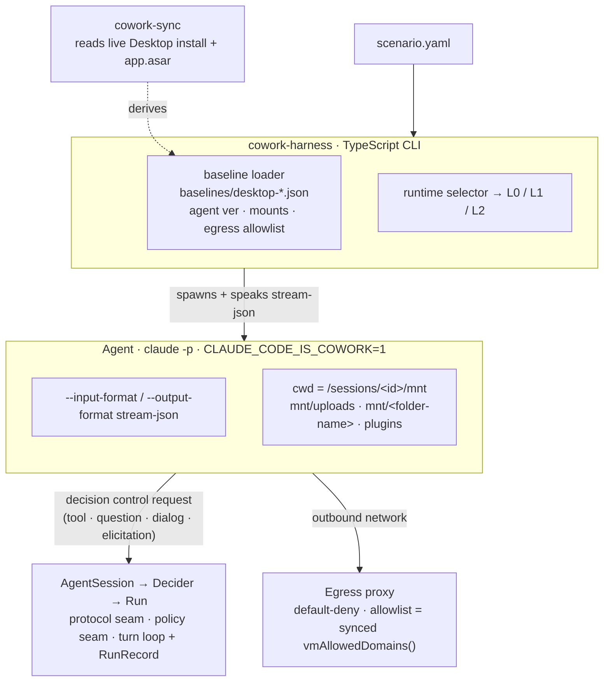

# DESIGN — parity model, deltas, and the maintenance contract

This document is the reference for *how faithful* each tier is, *what we deliberately don't reproduce*, and *why the chosen seams keep parity cheap to maintain*. Everything here is grounded in analysis of the live Claude Desktop `app.asar` (spawn contract and gates first verified at build 1.12603.1; updated through build 1.17377.1 — volatile fields tracked in `baselines/desktop-1.17377.1.json`) and the on-disk runtime state on macOS.

> **Just want to pick a tier or write a scenario?** This doc is the *why*. For the *how*, start at the
> [README](./README.md) (tiers, quick start) and [docs/](./docs/README.md) (scenario/session reference).
> Read on for the parity model, the deliberate deltas, and the maintenance contract.

## Architecture at a glance



(README carries the same diagram in ASCII, since npm doesn't render Mermaid.)

## 1. What "real Cowork" actually is (and why scripting it is closed)

A Cowork session is the Desktop app driving an agent that runs **inside an Apple Virtualization.framework microVM**:

- VM bundle: `~/Library/Application Support/Claude/vm_bundles/claudevm.bundle/` (`rootfs.img`, `sessiondata.img`, `efivars.fd`, `machineIdentifier`, `gvisorMacAddress`, `vmIP`); a warm pool at `vm_bundles/warm/<sha>/`.
- In-VM agent: `~/Library/Application Support/Claude/claude-code-vm/<ver>/claude` (currently **2.1.197**, an **ELF aarch64** binary), spawned by the host **in cowork mode via the `CLAUDE_CODE_IS_COWORK=1` env var** — *not* a `--cowork` flag (that flag is plugin-scope and the staged agent rejects it; see the control-protocol note below).
- Network: `vm_network_mode: "gvisor"`, egress through a userspace netstack with a **compiled domain allowlist**; off-list partners rejected (`partner rejected: entry not on compiled allowlist`).
- Control plane: Electron renderer→main typed IPC on channels named `$eipc_message$_<per-build-UUID>_$_claude.web_$_<Class>_$_<method>`, every handler validating `event.senderFrame.url` against a trusted-origin allowlist. The session manager is `LocalAgentModeSessions` (80 methods: `start`, `sendMessage`, `setDraftSessionFolders`, `onToolPermissionRequest`, `respondToToolPermission`, `getTranscript`, `onEvent`, …), bridged to the renderer as `window.cowork`.

**Why you can't script it:** the only in-context entry is the renderer, and remote debugging is closed on the shipping build — verified empirically (`--remote-debugging-port` opens no listener across clean trials) and structurally (Electron `EnableNodeCliInspectArguments` fuse OFF). Deep links don't create sessions; there's no host CLI entry (cowork mode is an in-guest env var, `CLAUDE_CODE_IS_COWORK=1` — not a `--cowork` flag; see §"Cowork mode is enabled by env" below). So we emulate the **contract**, not the app.

## 2. Parity matrix (per tier)

> Rows below are the three **isolation tiers** (L0/L1/L2). The two **loop-mode** tiers —
> `hostloop` (production split-execution) and `cowork` (auto-picks host-loop vs container) —
> are overlays on these and are covered in §"Spawn contract + host-loop vs VM-loop" below
> and the README tier table, not as separate columns here.
>
> **L0/L1/L2 are doc shorthand only** — the actual `fidelity:` values you write are `protocol` /
> `container` / `microvm` (plus the `hostloop` / `cowork` overlays). You never write `L1`.

| Aspect | Real Cowork | L0 protocol | L1 container | L2 microvm |
|---|---|---|---|---|
| Agent binary | staged `claude-code-vm/<ver>`, `CLAUDE_CODE_IS_COWORK=1` | host `claude` (may differ), run plain (control-loop only) | **pinned** `<ver>`, `CLAUDE_CODE_IS_COWORK=1` | pinned `<ver>`, `CLAUDE_CODE_IS_COWORK=1` |
| CPU/OS | linux/arm64 guest | host OS | linux/arm64 container | linux/arm64 guest |
| Mount layout | `/sessions/<id>/mnt/...` | cwd only (no mnt tree) | **full mnt tree** (bind) | **full mnt tree** |
| Skill discovery | plugin mount, runtime | local dir | **plugin mount** | **plugin mount** |
| Permission/question protocol | `can_use_tool` via IPC | `can_use_tool` stream-json | `can_use_tool` stream-json | `can_use_tool` stream-json |
| Egress control | gVisor + allowlist | **none** | allowlist proxy (default-deny) | allowlist proxy (default-deny, guest iptables) |
| Net transport | gVisor netstack | host | proxy (TCP/HTTP CONNECT) | proxy (TCP/HTTP CONNECT) |
| Filesystem isolation | VM | process | **container** | **VM** |
| Speed | — | fastest | fast | slow |
| CI-friendly | — | yes | **yes** | no |

**Rule of thumb:** test skill *logic + question handling* at L0; test skill *behavior under Cowork's mounts + egress* at L1; reach for L2 only when you need VM-grade escape isolation of untrusted code — L2's egress transport equals L1's (the same allowlist proxy), so it adds no network-transport fidelity.

## 3. Deliberate deltas (a green test still means something)

| Delta | Why it's acceptable for skill testing | When it bites |
|---|---|---|
| No Apple VZ kernel | Skills are agent-loop + tool behavior; kernel-invisible | Skill probes `/proc`, kernel version, VM artifacts |
| L1 and L2 egress is a proxy, not gVisor | Domain allow/deny is identical; that's what skills observe | Skill depends on raw-socket / non-HTTP egress behavior |
| No host-loop staging / mountPath RPC / bridge | Those are Desktop host services, not part of a portable skill | Skill calls a Desktop-only host RPC (non-portable by definition) |
| Host `claude` at L0 may differ from pinned ver | L0 is the fast lane; use L1 for version-exact | Version-specific tool/flag behavior — pin via L1 |
| Files mounted locally, not via `/v1/files` + `stage_file` | The skill only needs the file *present* at `mnt/uploads/`; it `Read`s the same path either way | Skill depends on the Files-API round-trip itself (id, gating) rather than file contents |
| Sessions resumed via the agent's native `--resume` + work-dir reuse, not the cloud `/v1/sessions` event log / cross-session store | The agent reloads `messages` + `fileHistorySnapshots` + `deferredToolUse` from its own sessionFile — behaviorally identical for a gate round-trip | Skill reads the server-side session event stream or the cross-session document store directly |

These are surfaced in the run report so a passing scenario is honest about which tier produced it. The
file/persistence deltas are **local-fidelity by design** — see SPEC §4.3; the resume path is binary-
verified (a fact set in run 1 is recalled after `--resume` in run 2).

## 4. The maintenance seam (why this survives releases)

Parity rot happens when release-specific facts are hard-coded in logic. We isolate them:

```
STABLE (rarely changes; lives in code)
  - the stream-json control protocol (can_use_tool / hook_callback / mcp_message / ...)
  - the scenario schema and assertions
  - the runtime selector and proxy mechanism

VOLATILE (changes per release; lives in baselines/*.json, sync-regenerated)
  - agentVersion
  - network.allowDomains + network.mode + requireFullVmSandbox
  - gates
  - asarFingerprint (provenance + "unknown delta" tripwire)

HAND-AUTHORED (in baselines/*.json, drift-guarded — sync does NOT extract these)
  - mountLayout (mount modes)
  - spawn.env.CLAUDE_CODE_IS_COWORK + bgEnvStrip.knownVars (BG env-strip list)
```

`cowork-sync`:
1. reads the live install (`claude-code-vm/.sdk-version`, `config.json`) and the `app.asar` main bundle,
2. re-derives every VOLATILE field,
3. computes an `asarFingerprint` over the cowork-relevant code regions,
4. emits `baselines/desktop-<appVersion>.json` and diffs against the committed one.

If the fingerprint changes but no known field did, sync reports `unknown delta` — your signal that Anthropic moved something the extractor doesn't read yet. That converts silent parity rot into a visible, actionable diff.

### Per-release runbook
```bash
cowork-harness sync --diff      # review agent bump / allowlist change / mount change
# extend src/sync/cowork-sync.ts if "unknown delta" is reported
git add baselines/desktop-<new>.json && git commit -m "parity: sync to Desktop <new>"
cowork-harness run examples/scenarios/   # regression: drift now shows as test diffs
```

### Rootfs / image drift checks

The agent *image* is a second fidelity surface (separate from the baseline facts above), and its drift is
caught the same "silent rot → visible signal" way:

- `scripts/capture-rootfs-manifest.ts --check <image>` diffs the **whole** Layer-A pip set — generated from
  `docker/Dockerfile.agent` rather than a hand-maintained subset, so a missing PDF/image package (pdf2image,
  pypdfium2, seaborn, …) fails the check instead of slipping through — plus the Node version, the apt
  document stack (`dpkg-query`), and global npm packages (`npm ls -g`).
- `scripts/build-rootfs-image.ts` tags the imported image by a **content hash** of `rootfs.img` (not
  size+mtime), so an in-place content change can't reuse a stale cached image; the hash is printed in build
  output.
- The image-capability probe cache keys on the image's **content** (id + created time), not a mutable tag —
  a rebuilt-in-place tag re-probes instead of serving stale capability facts.

## 5. Egress model details

Real Cowork compiles `{kind:"allowlist", domains:[...vmAllowedDomains(), ...coworkEgressAllowedHosts]}` (or `{kind:"unrestricted"}` iff the set contains `"*"`). Default allowlist captured from the live asar includes:

```
api.anthropic.com  a-api.anthropic.com  a-cdn.anthropic.com  api-staging.anthropic.com
console.anthropic.com  docs.anthropic.com  mcp-proxy.anthropic.com  support.anthropic.com
www.anthropic.com  *.claude.ai (assets / downloads / pivot / preview)  sentry.io
```

L1 reproduces this as a **default-deny forward proxy**: the agent's `HTTP(S)_PROXY` points at it, and only allowlisted hosts (baseline + the session's `egress.extra_allow`) get `CONNECT`-through; everything else is refused and logged to `egress.log`. Scenario `expect_denied` asserts denials. This matches what a skill *observes* (a blocked host fails) even though the transport differs from gVisor.

> Security note: the proxy is a **test fixture**, not a security boundary. Don't run untrusted skills against real credentials at L1 expecting VM-grade isolation; use L2 (real VM) for that. L1's job is faithful *behavioral* egress, not adversarial containment.

## 6. Control protocol mapping

| Cowork (Desktop IPC) | Harness (stream-json control) |
|---|---|
| `onToolPermissionRequest` (subscribe) | inbound `can_use_tool` control_request |
| `respondToToolPermission(allow/deny)` | `control_response` allow/deny |
| AskUserQuestion answered by question UI | allow + `updatedInput.answers` (Record<questionText, answer>) |
| `onEvent` live stream | stream-json assistant/tool messages → `events.jsonl` |
| `getTranscript` | accumulated stream → the `transcript` line in `run.jsonl` |
| `setDraftSessionFolders` / `addFolderToSession` | bind-mount into `mnt/<folder-name>` before launch |

The policy that produces those `allow`/`deny` responses is the **Decider** seam (see the architecture diagram); to smoke-test a decider against a sample question without a full run, use `cowork-harness decide`.

### Control protocol — VERIFIED end-to-end against the live host CLI (macOS build 2.1.177+; the staged in-VM agent that L1/L2 run is 2.1.197, baseline `desktop-1.17377.1`)

> The staged agent ELF is unchanged (2.1.181) across the 1.14271.0→1.15200.0 asar bump, and 2.1.187 across the 1.15200.0→1.15962.0 bump. The live scenario suite (`protocol` + `container` tiers) was re-run against the 1.15200.0 baseline; the 1.15962.0 bump was verified via asar analysis (content byte-identical: host-loop generator, system prompt, identity string, gates, and egress domains all unchanged) plus a full local test suite pass. The 1.15962.1→1.17377.1 bump moved the staged agent to **2.1.197** and added `api.claude.ai` to the egress allowlist; re-verified via `sync` (no unknown deltas) plus a manual asar spot-check of the reconstructed prompt content (substantively unchanged — see the Parity entry in CHANGELOG.md) and a full live scenario-suite pass (`protocol` + `container` tiers).

The handshake and shapes below were confirmed empirically with an end-to-end run, not inferred:

1. **Spawn flags:** `-p --verbose --input-format stream-json --output-format stream-json --permission-prompt-tool stdio`. The `stdio` permission-prompt-tool is what routes `can_use_tool`/AskUserQuestion to the driver; `--verbose` is required by `--output-format=stream-json --print`.
2. **Handshake:** the driver sends `{type:"control_request", request_id, request:{subtype:"initialize"}}` as the first message, then the user turn. Without it, permissions/questions are auto-handled (AskUserQuestion is silently dismissed).
3. **Inbound permission/question:** `{type:"control_request", request_id, request:{subtype:"can_use_tool", tool_name, input, tool_use_id}}`. For AskUserQuestion, `input.questions[] = {question, header, options:[{label,description}], multiSelect}`.
4. **Response envelope (nested!):** `{type:"control_response", response:{subtype:"success", request_id, response:{behavior:"allow", updatedInput} | {behavior:"deny", message}}}`. The payload sits under an **inner** `response`; missing that nesting yields `ZodError: expected object, received undefined`.
5. **AskUserQuestion answer:** allow with `updatedInput.answers = Record<questionText, chosenLabel>` (the CLI's own schema is `z.record(z.string(), z.string())`). The model receives the answer and proceeds.

> **Cowork mode is enabled by env, not a flag.** In the staged agent (2.1.197) `--cowork` is a *plugin-scope* flag ("can only be used with user scope") and is rejected by the agent invocation; cowork mode is entered via **`CLAUDE_CODE_IS_COWORK=1`**. (Do **not** also set `CLAUDE_CODE_USE_COWORK_PLUGINS` — Desktop doesn't, and it flips the agent's userSettings filename to `cowork_settings.json` and plugin cache to `cowork_plugins/` via `TSO()` — the minified Desktop helper that derives the cowork settings/cache paths; plugins are delivered via `--plugin-dir`.) The host CLI is a different (macOS) build, so L0 runs plain (control-loop validation only); L1/L2 run the staged **Linux/arm64** binary — bind-mounted from the user's own install.

### Spawn contract + host-loop vs VM-loop (binary-verified through asar 1.17377.1)

The full Desktop→agent spawn contract (cwd `/sessions/<id>`, `CLAUDE_CONFIG_DIR=mnt/.claude`, the env object, `--tools`/`--allowedTools`/`--plugin-dir`/`--effort`/`--setting-sources`, permission layers, prompt templates) is documented in [docs/cowork-spawn-contract-1.12603.1.md](./docs/cowork-spawn-contract-1.12603.1.md) and encoded in `baseline.spawn`.

**Which Cowork? — both are implemented.** Production runs **host-loop** (the host-loop GrowthBook gate `1143815894`, forced on per the decoded *fcache* — Desktop's on-disk GrowthBook feature-flag cache): the agent loop runs on the host, shell is `mcp__workspace__bash` into the VM, `${CLAUDE_PLUGIN_ROOT}` is a host path. VM-loop (gate off / `requireCoworkFullVmSandbox` orgs) runs the whole agent in the sandbox.

- `fidelity: container | microvm` → **VM-loop** (the whole agent in the sandbox).
- `fidelity: hostloop` → **host-loop**: native Bash/WebFetch disabled (`--disallowedTools`), and the agent's shell routed through the **workspace SDK-MCP server** — declared via `sdkMcpServers:["workspace"]` in the `initialize` handshake (verified mechanism), with the driver (`src/agent/session.ts` + `src/hostloop/workspace-handler.ts`) handling `mcp_message` JSON-RPC and executing `bash` via `docker exec` into the agent container at `/sessions/<id>/mnt`. `${CLAUDE_PLUGIN_ROOT}` is set to a `/host/...` path that doesn't exist in bash → a skill must self-heal via `find /sessions/<id>/mnt …`, exactly like production. Verified end-to-end: `mcp_servers:[{workspace,connected}]`, the agent calls `mcp__workspace__bash`, and `[ -d $CLAUDE_PLUGIN_ROOT ]` is false in bash. (Unlike production's host-loop — where the agent process itself runs on the host, per the "Which Cowork?" paragraph above — the harness's `hostloop` tier always runs the agent process in the container; only the tool-routing is split.)
- `fidelity: cowork` → **auto-picks** host-loop vs VM-loop using Cowork's own decision logic (`src/loop-decision.ts`, an exact replica of Desktop's minified `f_()` loop-decision function): `requireFullVmSandbox || forceDisableHostLoop ? vm : (dev override ? host : gate 1143815894)`. With the synced gate forced on, `cowork → hostloop`. (The replicated `f_()` **decision shape** is pinned to asar 1.12603.1 per `src/loop-decision.ts`; the 1.15200.0→1.15962.0 sync re-derives only the **gate value** it reads, not the logic.)

The **bash-visible world is identical** in both (`/sessions/<id>/mnt/...`); the agent-loop world differs (`${CLAUDE_PLUGIN_ROOT}` resolution, the shell tool). Use `hostloop` (or `cowork`) for production-faithful skill testing; `container` for fast VM-loop.
