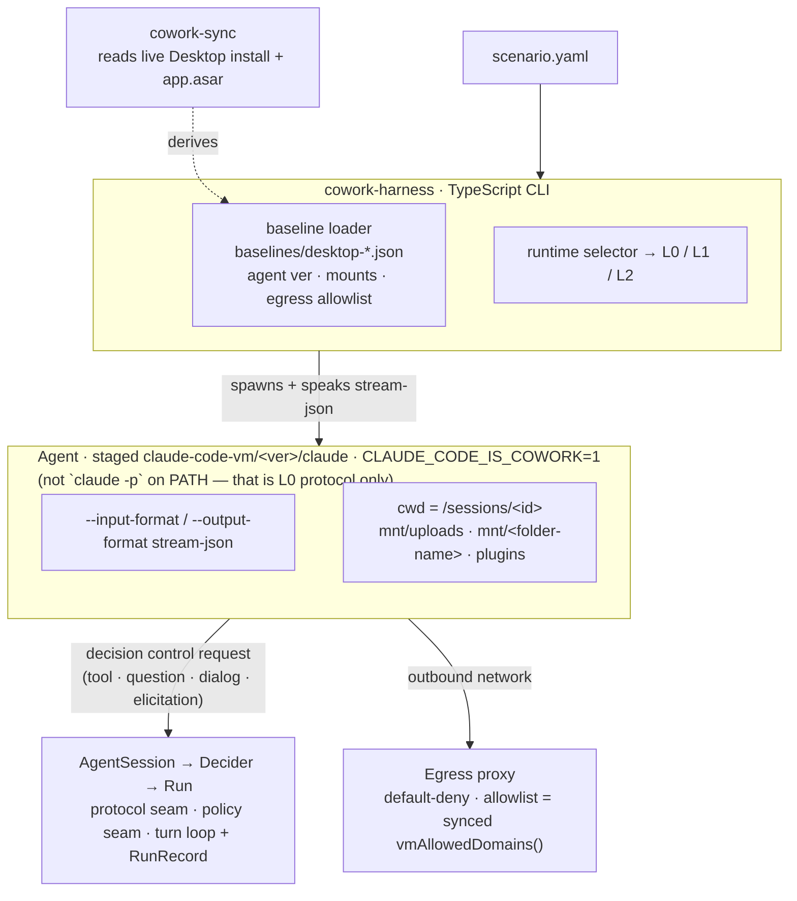

# DESIGN — parity model, deltas, and the maintenance contract

This document is the reference for *how faithful* each tier is, *what we deliberately don't reproduce*, and *why the chosen seams keep parity cheap to maintain*. Everything here is grounded in analysis of the live Claude Desktop `app.asar` (spawn contract and gates first verified at build 1.12603.1; updated through the newest baseline in `baselines/` (see `baselines/desktop-*.json`; `cowork-harness sync --diff` adds the next one)) and the on-disk runtime state on macOS.

> **Just want to pick a tier or write a scenario?** This doc is the *why*. For the *how*, start at the
> [README](./README.md) (tiers, quick start) and [docs/](./docs/README.md) (scenario/session reference).
> Read on for the parity model, the deliberate deltas, and the maintenance contract.

## Architecture at a glance


```mermaid
flowchart TB
    SCN["scenario.yaml"] --> CLI
    SYNC["cowork-sync<br/>reads live Desktop install + app.asar"]

    subgraph CLI["cowork-harness · TypeScript CLI"]
        direction TB
        BL["baseline loader<br/>baselines/desktop-*.json<br/>agent ver · mounts · egress allowlist"]
        RS["runtime selector → L0 / L1 / L2"]
    end
    SYNC -.->|derives| BL

    CLI -->|"spawns + speaks stream-json"| AGENT
    subgraph AGENT["Agent · staged claude-code-vm/&lt;ver&gt;/claude · CLAUDE_CODE_IS_COWORK=1<br/>(not `claude -p` on PATH — that is L0 protocol only)"]
        direction TB
        IO["--input-format / --output-format stream-json"]
        FS["cwd = /sessions/&lt;id&gt;<br/>mnt/uploads · mnt/&lt;folder-name&gt; · plugins"]
    end

    AGENT -->|"decision control request<br/>(tool · question · dialog · elicitation)"| DRV["AgentSession → Decider → Run<br/>protocol seam · policy seam · turn loop + RunRecord"]
    AGENT -->|"outbound network"| EG["Egress proxy<br/>default-deny · allowlist = synced vmAllowedDomains()"]
```

(README carries the same diagram in ASCII, since npm doesn't render Mermaid.)

> The agent node above is the **VM-loop** path (`container`/`microvm`), which runs the staged Linux ELF.
> `hostloop` runs a **different** staged binary — the native macOS `claude-code/<ver>/[<build>/]claude.app/…` — as a
> host process with no container around it, and `protocol` (L0) is the only tier that uses `claude` from
> your `PATH`. See § 6 and [docs/fidelity-gaps.md](./docs/fidelity-gaps.md).

## 1. What "real Cowork" actually is (and why scripting it is closed)

Cowork runs a session in one of two lanes. This section describes the **local** lane — the Desktop app driving the
agent on the user's own machine, with an **Apple Virtualization.framework microVM** as the sandbox — which is the lane
this harness emulates. Where the agent LOOP runs inside that lane is a separate axis, and on the pinned baseline it is
the host, not the VM: see "Which Cowork? — both are implemented" under
[§6, Control protocol mapping](#6-control-protocol-mapping) below, which is authoritative over the
sandbox-centric description here. The **remote** lane runs the agent in an Anthropic-hosted cloud container instead.
Anthropic [documents the cloud as Cowork's default](https://support.claude.com/en/articles/14479288-claude-cowork-architecture-overview),
and [from 2026-10-06 new Pro and Max tasks run in the cloud](https://support.claude.com/en/articles/15520349-use-claude-cowork-on-web-desktop-and-mobile).
Before then no setting reliably decided which lane a session got (see
[docs/fidelity-gaps.md → Which lane a session actually ran on](./docs/fidelity-gaps.md#which-lane-a-session-actually-ran-on)). The lanes differ
in how a file reaches the user, which is what changes skill behaviour: see
[docs/fidelity-gaps.md](./docs/fidelity-gaps.md) → "File delivery" for the split and
[docs/scenario.md](./docs/scenario.md)'s `lane:` key for holding a run to either contract. The local lane:

- VM bundle: `~/Library/Application Support/Claude/vm_bundles/claudevm.bundle/` (`rootfs.img`, `sessiondata.img`, `efivars.fd`, `machineIdentifier`, `gvisorMacAddress`, `vmIP`); a warm pool at `vm_bundles/warm/<sha>/`.
- In-VM agent: `~/Library/Application Support/Claude/claude-code-vm/<ver>/claude` (currently **2.1.293**, per `baselines/desktop-2.26454.2.json`, an **ELF aarch64** binary), spawned by the host **in cowork mode via the `CLAUDE_CODE_IS_COWORK=1` env var** — *not* a `--cowork` flag (that flag is plugin-scope and the staged agent rejects it; see the control-protocol note below). Each baseline records this ELF's `sha256` (`agentBinary.sha256`/`shaProvenance`), and the resolver integrity-checks the binary it's about to run against that hash by default (opt out `COWORK_HARNESS_VERIFY_AGENT_SHA=0`), so "the same pinned agent" is enforced, not just asserted. Old versions are re-downloadable + verifiable from the official release channel — from the channel that baseline's `agentBinary.releaseBaseUrl` names, which is **not always the stable path** (Desktop stages release candidates too); the exact command is in `docs/maintenance.md`.
- Network: `vm_network_mode: "gvisor"`, egress through a userspace netstack with a **compiled domain allowlist**; off-list partners rejected (`partner rejected: entry not on compiled allowlist`).
- Control plane: Electron renderer→main typed IPC on channels named `$eipc_message$_<per-build-UUID>_$_claude.web_$_<Class>_$_<method>`, every handler validating `event.senderFrame.url` against a trusted-origin allowlist. The session manager is `LocalAgentModeSessions` (80 methods: `start`, `sendMessage`, `setDraftSessionFolders`, `onToolPermissionRequest`, `respondToToolPermission`, `getTranscript`, `onEvent`, …), bridged to the renderer as `window.cowork`.

**Why you can't script it:** the only in-context entry is the renderer, and remote debugging is closed on the shipping build — verified empirically (`--remote-debugging-port` opens no listener across clean trials) and structurally (Electron `EnableNodeCliInspectArguments` fuse OFF). Deep links don't create sessions; there's no host CLI entry (cowork mode is an in-guest env var, `CLAUDE_CODE_IS_COWORK=1` — not a `--cowork` flag; see §"Cowork mode is enabled by env" below). So we emulate the **contract**, not the app.

> **This page vs. the other four.** Fidelity is documented in five places, on purpose — each answers a
> different question:
>
> | Question | Page |
> |---|---|
> | *Which tier should I pick?* | [README → Fidelity tiers](./README.md#fidelity-tiers-pick-per-scenario--per-ci-job) — the decision table |
> | *What does each tier enforce?* | [boundary.md](./docs/boundary.md) |
> | *What does each tier NOT reproduce?* | [fidelity-gaps.md](./docs/fidelity-gaps.md) |
> | *Why is it built this way?* | **this page, § 2 below** |
> | *I only have the installed plugin* | [references/fidelity-and-answers.md](./.claude/skills/cowork-harness/references/fidelity-and-answers.md) — offline snapshot |

## 2. Parity matrix (per tier)

> Rows below are the three **isolation tiers** (L0/L1/L2). The two **loop-mode** tiers —
> `hostloop` (production split-execution) and `cowork` (auto-picks host-loop vs container) —
> are overlays on these and are covered in §"Spawn contract + host-loop vs VM-loop" below
> and the README tier table, not as separate columns here.
>
> **L0/L1/L2 are doc shorthand only** — the actual `fidelity:` values you write are `protocol` /
> `container` / `microvm` (plus the `hostloop` / `cowork` overlays). You never write `L1`.

| Aspect | Real Cowork | L0 protocol | L1 container | L2 microvm |
|---|---|---|---|---|
| Agent binary | staged `claude-code-vm/<ver>`, `CLAUDE_CODE_IS_COWORK=1` | host `claude` (may differ), run plain (control-loop only) | **pinned** `<ver>`, `CLAUDE_CODE_IS_COWORK=1` | pinned `<ver>`, `CLAUDE_CODE_IS_COWORK=1` |
| CPU/OS | linux/arm64 guest | host OS | linux/arm64 container | linux/arm64 guest |
| Mount layout | `/sessions/<id>/mnt/...` | cwd only (no mnt tree) | **full mnt tree** (bind) | **full mnt tree** |
| Skill discovery | plugin mount, runtime | local dir | **plugin mount** | **plugin mount** |
| Permission/question protocol | `can_use_tool` via IPC | `can_use_tool` stream-json | `can_use_tool` stream-json | `can_use_tool` stream-json |
| Egress control | gVisor + allowlist | **none** | allowlist proxy (default-deny) | allowlist proxy (default-deny, guest iptables) |
| Net transport | gVisor netstack | host | proxy (TCP/HTTP CONNECT) | proxy (TCP/HTTP CONNECT) |
| Filesystem isolation | VM | process | **container** | **VM** |
| Speed | — | fastest | fast | slow |
| CI-friendly | — | yes | **yes** | no |

**Rule of thumb:** test skill *logic + question handling* at L0; test skill *behavior under Cowork's mounts + egress* at L1; reach for L2 only when you need VM-grade escape isolation of untrusted code — L2's egress transport equals L1's (the same allowlist proxy), so it adds no network-transport fidelity.

## 3. Deliberate deltas (a green test still means something)

| Delta | Why it's acceptable for skill testing | When it bites |
|---|---|---|
| No Apple VZ kernel | Skills are agent-loop + tool behavior; kernel-invisible | Skill probes `/proc`, kernel version, VM artifacts |
| L1 and L2 egress is a proxy, not gVisor | Allow/deny is decided per domain against the pinned allowlist, which is what skills observe | Skill depends on raw-socket / non-HTTP egress behavior, or on a domain where the pinned list and production's server-delivered set differ |
| No host-loop staging / mountPath RPC / bridge | Those are Desktop host services, not part of a portable skill | Skill calls a Desktop-only host RPC (non-portable by definition) |
| Host `claude` at L0 may differ from pinned ver | L0 is the fast lane; use L1 for version-exact | Version-specific tool/flag behavior — pin via L1 |
| Files mounted locally, not via `/v1/files` + `stage_file` | The skill only needs the file *present* at `mnt/uploads/`; it `Read`s the same path either way | Skill depends on the Files-API round-trip itself (id, gating) rather than file contents |
| Sessions resumed via the agent's native `--resume` + work-dir reuse, not the cloud `/v1/sessions` event log / cross-session store | The agent reloads `messages` + `fileHistorySnapshots` + `deferredToolUse` from its own sessionFile — behaviorally identical for a gate round-trip | Skill reads the server-side session event stream or the cross-session document store directly |

These are surfaced in the run report so a passing scenario is honest about which tier produced it. The
file/persistence deltas are **local-fidelity by design** — see SPEC §4.3; the resume path is binary-
verified (a fact set in run 1 is recalled after `--resume` in run 2).

## 4. The maintenance seam (why this survives releases)

Parity rot happens when release-specific facts are hard-coded in logic. We isolate them:

```
STABLE (rarely changes; lives in code)
  - the stream-json control protocol (can_use_tool / hook_callback / mcp_message / ...)
  - the scenario schema and assertions
  - the runtime selector and proxy mechanism

VOLATILE (changes per release; lives in baselines/*.json, sync-regenerated)
  - agentVersion
  - network.allowDomains + network.mode + requireFullVmSandbox
  - gates
  - asarFingerprint (provenance + "unknown delta" tripwire)
  - cloud (the remote-devices tool list + description fingerprints; data only, never carried forward;
    its `unreachable` list is curated in code, not extracted)

HAND-AUTHORED (in baselines/*.json, drift-guarded — sync does NOT extract these)
  - mountLayout (mount modes)
  - spawn.env.CLAUDE_CODE_IS_COWORK + bgEnvStrip.knownVars (BG env-strip list)
```

The sync extractor (`src/sync/cowork-sync.ts`, driven by `cowork-harness sync`):
1. reads the live install (`claude-code-vm/.sdk-version`, `config.json`) and the `app.asar` main bundle,
2. re-derives every VOLATILE field,
3. computes an `asarFingerprint` over the cowork-relevant code regions,
4. emits `baselines/desktop-<appVersion>.json` and diffs against the committed one.

If the fingerprint changes but no known field did, sync reports `unknown delta` — your signal that Anthropic moved something the extractor doesn't read yet. That converts silent parity rot into a visible, actionable diff.

### Per-release runbook
```bash
cowork-harness sync --diff      # review agent bump / allowlist change / mount change
# extend src/sync/cowork-sync.ts if "unknown delta" is reported
git add baselines/desktop-<new>.json && git commit -m "parity: sync to Desktop <new>"
cowork-harness run examples/scenarios/   # regression: drift now shows as test diffs
```

### Rootfs / image drift checks

The agent *image* is a second fidelity surface (separate from the baseline facts above), and its drift is
caught the same "silent rot → visible signal" way:

- `scripts/capture-rootfs-manifest.ts --check <image>` diffs the **whole** Layer-A pip set — generated from
  `docker/Dockerfile.agent` rather than a hand-maintained subset, so a missing PDF/image package (pdf2image,
  pypdfium2, seaborn, …) fails the check instead of slipping through — plus the Node version, the apt
  document stack (`dpkg-query`), and global npm packages (`npm ls -g`).
- `scripts/build-rootfs-image.ts` tags the imported image by a **content hash** of `rootfs.img` (not
  size+mtime), so an in-place content change can't reuse a stale cached image; the hash is printed in build
  output.
- The image-capability probe cache keys on the image's **content** (id + created time), not a mutable tag —
  a rebuilt-in-place tag re-probes instead of serving stale capability facts.

## 5. Egress model details

Real Cowork compiles `{kind:"allowlist", domains:[...vmAllowedDomains(), ...coworkEgressAllowedHosts]}` (or `{kind:"unrestricted"}` iff the set contains `"*"`). The default allowlist below is a **pinned, hand-curated reconstruction, not an extraction** — on the first-party deployment this harness models the VM egress allowlist is not in the app bundle at all (that deployment class returns `vmEgressPolicy(){return null}`, so the session's SERVER-DELIVERED `egressAllowedDomains` is used instead), which means it cannot be read out of the asar. It is the list the harness **enforces**; whether it equals production's server-delivered set is unverified, and four entries (`www.`, `console.`, `support.`, `docs.anthropic.com`) are flagged unverified-as-VM-egress in the baseline's own `network.$comment`. `sync` carries the list forward and never re-derives it:

```
api.anthropic.com  a-api.anthropic.com  a-cdn.anthropic.com  api-staging.anthropic.com
console.anthropic.com  docs.anthropic.com  mcp-proxy.anthropic.com  support.anthropic.com
www.anthropic.com  *.claude.ai (assets / downloads / pivot / preview)  sentry.io
```

L1 reproduces this as a **default-deny forward proxy**: the agent's `HTTP(S)_PROXY` points at it, and only allowlisted hosts (baseline + the session's `egress.extra_allow`) get `CONNECT`-through; everything else is refused and logged to `egress.log`. Scenario `expect_denied` asserts denials. This matches what a skill *observes* (a blocked host fails) even though the transport differs from gVisor.

> Security note: the proxy is a **test fixture**, not a security boundary. Don't run untrusted skills against real credentials at L1 expecting VM-grade isolation; use L2 (real VM) for that. L1's job is faithful *behavioral* egress, not adversarial containment.

## 6. Control protocol mapping

| Cowork (Desktop IPC) | Harness (stream-json control) |
|---|---|
| `onToolPermissionRequest` (subscribe) | inbound `can_use_tool` control_request |
| `respondToToolPermission(allow/deny)` | `control_response` allow/deny |
| AskUserQuestion answered by question UI | allow + `updatedInput = {questions, answers}` — BOTH keys required (Record<questionText, answer>) |
| `onEvent` live stream | stream-json assistant/tool messages → `events.jsonl` |
| `getTranscript` | accumulated stream → the `transcript` line in `run.jsonl` |
| `setDraftSessionFolders` / `addFolderToSession` | bind-mount into `mnt/<folder-name>` before launch |

The policy that produces those `allow`/`deny` responses is the **Decider** seam (see the architecture diagram); to smoke-test a decider against a sample question without a full run, use `cowork-harness decide`.

> **Machine-readable form:** the five shapes below are schema'd as `schema/protocol.v1.json`, with a golden vector pack at `fixtures/protocol/v1/` — see [docs/protocol.md](./docs/protocol.md) for scope, versioning, and how to conformance-test against them.

### Control protocol — VERIFIED end-to-end against the live host CLI (macOS)

> **This heading deliberately carries no version or baseline figures.** It used to restate the agent
> version and baseline of the last live pass, and those went stale independently of the note below it
> — at one point naming three different agent versions across two adjacent sentences. **The "Scope of
> that claim" note below is the single authority** for which baseline and agent were actually
> exercised, and for what the pass did and did not cover. Read it before citing this heading.
>
> (Historical note, kept because it is a deliberate decision rather than an omission: the
> `desktop-1.20186.1` baseline is a patch-only Desktop release — egress allowlist, spawn config and the
> Cowork system-prompt fingerprint all unchanged from `1.20186.0`, with the staged VM ELF re-synced
> 2.1.202 → 2.1.205 — and the live pass of that era was deliberately **not** restamped onto it.)

> **Scope of that claim.** `2026-10-08 / desktop-2.26454.2` is the baseline carrying the latest live pass, run against agent **2.1.293** (the staged Linux ELF for `container`, and the staged native macOS build `8433d0d9cd0d` for `hostloop`, with no override of either); the `protocol` tier runs the HOST `claude`, **2.1.294** for this pass. No baselines have shipped since. **The 4.6.0 pass, 2026-10-08, on the release-prep branch at `daf3479d`**: (i) `vitest list --staticParse=false` listed all 24 live tests with no `SKIPPED` warning when the token was exported, and 6 with five warnings when none was resolvable; (ii) the live suite on `protocol`, `container` and `hostloop`: 24 passed, one pre-registered skip, including the plugin hook-decision test on `container` (a PreToolUse hook denying by JSON, one exiting 2, and a Stop hook blocking once, graded by `hook_decision` and both forms of `hook_event_blocked`); (iii) the auto-memory check on all three tiers, `Tests  2 passed (2)` each, every init frame without `memory_paths`; (iv) the companion skill's router check, three prompts on `container`, against the split assertion catalog: the authoring prompt read `authoring.md` and `scenario-schema.md` and wrote a session file and a scenario that pass `lint` with no error or warning, the debugging prompt read `debugging.md` and asked for the run's `result.json`, and the tool-timing prompt read `measurement.md` and answered with `trace … --view tool-durations`; (v) `gates_all_scripted` on `container`: a scripted multi-select gate passed, and the same scenario with its answer removed and `on_unanswered: first` failed on exactly that assertion, naming the gate as answered by `first`; (vi) `answer_channel: none` on `container`, with a probe skill that records a status file before asking: the run passed with a `parked_at_question` warning and no `stalled` fail, carried the headless label and `answerChannel: "none"`, graded the status file through an `artifact_json` glob, and its init frame listed no `AskUserQuestion`. Live spend about **$2.21**. The 4.4.1, 4.4.0 and 4.3.0 passes below ran on `desktop-2.19675.0` (agent 2.1.286). **The 4.5.0 pass, 2026-10-07, on `desktop-2.26454.0` (agent 2.1.289; host `claude` 2.1.292 for `protocol`), on the release-prep branch at `af26c3c7`** (the commits after it change docs and the companion skill only): (i) `vitest list --staticParse=false` listed all 23 live tests with no `SKIPPED` warning when the token was exported, and 6 with four warnings when none was resolvable; (ii) the live suite on `protocol`, `container` and `hostloop`: 23 passed, one pre-registered skip; (iii) the auto-memory check on all three tiers, `Tests  2 passed (2)` each, every init frame without `memory_paths`; (iv) the companion skill's router check, three prompts on `container`: the authoring prompt read `authoring.md` (and `assertion-catalog.md`, searching `scenario-schema.md`) but wrote a scenario with an inline `session:` block, which fails `lint`, so it failed; `authoring.md` now says `session:` is a path, and one re-run read `authoring.md` and `scenario-schema.md` and asked for the skill's path instead of writing a scenario, so the corrected sentence is checked by `lint`, not by a live answer. The debugging prompt read no reference and answered with correct clarifying questions; the tool-timing prompt loaded the skill, read no reference and asked which run to time, so `measurement.md` routing was not exercised in this pass; (v) the forced-compaction recipe on `container`: a task turn, a resumed `/compact` turn whose `result.json` records a manual `compact_boundary` (40,266 → 2,896 tokens; the check exits 1 on the task turn), and a resumed turn that still named the command it had described before the compaction. The recipe first said to check this with `verify-run`, which refuses a run dir with more than one turn; it now reads the `/compact` turn's own `result.json`. Live spend about **$2.53**. **The 4.4.1 pass, 2026-10-05, on the release-prep commit `3e6fe443`** (a companion-skill-only release; same baseline and staged agent; host `claude` 2.1.289 for `protocol`): (i) `vitest list --staticParse=false` listed all 23 live tests with no `SKIPPED` warning when the token was exported, and 6 with four warnings when none was resolvable; (ii) the auto-memory check on all three tiers, `Tests  2 passed (2)` each, every init frame without `memory_paths`; (iii) the companion skill's router check, three prompts on `container`: the authoring prompt read `authoring.md` (and `scenario-schema.md`, searching `assertion-catalog.md`) and wrote a scenario that passes `lint` with no error or warning, the debugging prompt read `debugging.md` and answered with correct clarifying questions, and the tool-timing prompt read `measurement.md` (and `debugging.md`, which documents `trace`'s views) and answered with `trace … --view tool-durations`. The live suite itself was not re-run: this release changes no code that runs. Live spend about **$1.08**. **The 4.4.0 pass, 2026-10-05, on the release-prep commit `e9c516df`** (same baseline and staged agent; host `claude` 2.1.289 for `protocol`): (i) `vitest list --staticParse=false` listed all 23 live tests with no `SKIPPED` warning when the token was exported, and 6 with four warnings when none was resolvable; (ii) the live suite on `protocol`, `container` and `hostloop`: 23 passed, one pre-registered skip; (iii) the auto-memory check on all three tiers, `Tests  2 passed (2)` each; (iv) the companion skill's router check, three prompts on `container`: the authoring prompt read `authoring.md` and wrote a scenario that passes `lint`, the tool-timing prompt read `measurement.md` and answered with `trace … --view tool-durations`, and the debugging prompt read no reference and answered with correct clarifying questions, so `debugging.md` routing was not exercised in this pass; (v) the re-grade scrub-set check: a live run on the default runs root created `scrubset.key` beside the runs directory (mode 0600) and recorded `scrubSet` (`v: 1`) with the configured scrub literal absent from `result.json`; a re-grade of that run with an edited rubric line and a smaller scrub set was refused as `rubric_unverifiable` (exit 2) naming only the edited line, with no judge call and the run directory byte-identical; and a re-grade of a run recorded before 4.4 with an edited rubric line was refused with the `legacy` reason and the one-line remedy, again with no judge call and the run directory byte-identical. Live spend about **$2.83** recorded. **The 4.3.0 pass, on the release commit `8a5e479f`:** (1) the live suite on `protocol`, `container` and `hostloop`: 23 passed, one pre-registered skip (the auto-memory prerequisites check, which runs only under `COWORK_LIVE_REQUIRE=1`); before it ran, `vitest list --staticParse=false` listed all 23 with no `SKIPPED` warning, and 6 with four warnings when no token was resolvable, so a silent skip would have shown; (2) the auto-memory check on all three tiers, `Tests  2 passed (2)` each, every init frame without `memory_paths`; (3) the graders' pinned effort: every judged assert that called the judge in the live hillclimb acceptance runs (45, Opus 4.8: 25 `semantic_matches`, 20 `semantic_pairwise`; host `claude` 2.1.288 and 2.1.289) records `judgeTransport.effort: "high"`; the five pairwise asserts without a `judgeTransport` are the reference variant's own rows, which call no judge. **Earlier in the same release, on the release candidate's tree:** (4) a `microvm` smoke on a freshly booted VM (agent 2.1.286); (5) `boundary-check`, 6/6 constraints enforced; (6) an `eval` A/A at `--reps 4` on `container`, every row `no detectable change`, its report rebuilt byte-identical; (7) the companion skill's router check, three prompts on `container`: routing was correct on all three; one answer was wrong because a reference showed `artifact_text`'s `contains` without its list shape (fixed in the references, with a test that keeps every list-typed field shown as a list), and the same prompt's verdict went red on a false `host_path_leak`, because a reference spelled out the host roots that check looks for and the agent echoed it (fixed in the skill's files and in the check, which no longer counts a literal that comes from the plugin's or a local skill's own staged files); re-run after the fixes, the prompt routed correctly, wrote a scenario that passes `lint` and loads, and carried no `host_path_leak`; (8) the `hostloop` detached-agent kill check: the first pass found the workspace sidecar container, its `docker run` client and its network surviving SIGINT, which was fixed, and the re-run passed on a normal run, SIGINT to the harness process and SIGINT to the whole process group (exit 130, nothing left behind); (9) `vm delete`'s usage refusal; (10) `chat` under a real terminal, on `protocol`: Ctrl-C mid-turn exits 130 in about 2 s with nothing left running and no `result.json`; `/exit` followed by Ctrl-C exits 130 after writing the turn's `result.json`; Ctrl-C at the idle prompt ends the session normally (exit 0, `result.json` written); SIGHUP mid-turn exits 129 with nothing left running; and closing the terminal window mid-turn (run by hand) leaves no harness or agent process and no `result.json`. Total live spend about **$11.20**, including the re-runs. **Scope-out, so this is not read as more than it is.** (a) A live pass verifies observed behaviour, not the whole spawn contract by construction, and these checks are model-dependent, so a single red is evidence of model variance until a re-run says otherwise. (b) **CI does not live-validate anything.** Its "scenario suite (… live inference)" job is skipped as a whole without an `ANTHROPIC_API_KEY` repository secret, and none is set, so it shows as *skipped*. Before 2026-09 it instead ran with every real step skipped and reported *success*, so an older green check there means nothing ran. This note, not CI, is the live evidence. Separately and not a live matter: all four committed cassettes were **re-recorded** on 2026-10-03 against `2.19675.0` with auto-memory off, each on its original model: `example-pdf-skill` and `test/fixtures/tool-call-dispatch/dispatch-shell.cassette.json` (`container`, agent 2.1.286), `hostloop-computer-links` (`hostloop`, agent 2.1.286) and `example-multiselect-gate` (`protocol`, which runs the host CLI, here 2.1.287), about $0.75 in all. Their init frames carry no `memory_paths`. The recorder's own scrub (now applied to every recording) removed, across the four, the account's model menu, a subscription account's `rate_limit_info` (from `example-pdf-skill`, `dispatch-shell` and `hostloop-computer-links`) and the agent's sub-agent hand-back frame (from `dispatch-shell`). `verify-cassettes` exits 0 on all four, with one accepted `unscanned` entry (`example-pdf-skill`'s uploaded artifact body, too large to commit). Re-stamp this paragraph, naming the baseline, whenever a live pass is actually re-run.

> The staged agent ELF is unchanged (2.1.181) across the 1.14271.0→1.15200.0 asar bump, and 2.1.187 across the 1.15200.0→1.15962.0 bump. The live scenario suite (`protocol` + `container` tiers) was re-run against the 1.15200.0 baseline; the 1.15962.0 bump was verified via asar analysis (content byte-identical: host-loop generator, system prompt, identity string, gates, and egress domains all unchanged) plus a full local test suite pass. The 1.15962.1→1.17377.1 bump moved the staged agent to **2.1.197** and added `api.claude.ai` to the egress allowlist; re-verified via `sync` (no unknown deltas) plus a manual asar spot-check of the reconstructed prompt content (substantively unchanged — see the Parity entry in CHANGELOG.md) and a full live scenario-suite pass (`protocol` + `container` tiers).

The handshake and shapes below were confirmed empirically with an end-to-end run, not inferred:

1. **Spawn flags:** `-p --verbose --input-format stream-json --output-format stream-json --permission-prompt-tool stdio` (under the session key `answer_channel: none`, `--permission-prompts none` replaces the stdio tool). The `stdio` permission-prompt-tool is what routes `can_use_tool`/AskUserQuestion to the driver; `--verbose` is required by `--output-format=stream-json --print`.
2. **Handshake:** the driver sends `{type:"control_request", request_id, request:{subtype:"initialize"}}` as the first message, then the user turn. Without it, permissions/questions are auto-handled (AskUserQuestion is silently dismissed).
3. **Inbound permission/question:** `{type:"control_request", request_id, request:{subtype:"can_use_tool", tool_name, input, tool_use_id}}`. For AskUserQuestion, `input.questions[] = {question, header, options:[{label,description}], multiSelect}`.
4. **Response envelope (nested!):** `{type:"control_response", response:{subtype:"success", request_id, response:{behavior:"allow", updatedInput} | {behavior:"deny", message}}}`. The payload sits under an **inner** `response`; missing that nesting yields `ZodError: expected object, received undefined`.
5. **AskUserQuestion answer:** allow with `updatedInput = {questions, answers}` — BOTH keys required (dropping `questions` breaks the binary's built-in `questions.map(...)` handler); `answers = Record<questionText, chosenLabel>` (the CLI's own schema is `z.record(z.string(), z.string())`). The model receives the answer and proceeds.

> **Cowork mode is enabled by env, not a flag.** In the staged agent (2.1.197) `--cowork` is a *plugin-scope* flag ("can only be used with user scope") and is rejected by the agent invocation; cowork mode is entered via **`CLAUDE_CODE_IS_COWORK=1`**. (Do **not** also set `CLAUDE_CODE_USE_COWORK_PLUGINS` — Desktop doesn't, and it flips the agent's userSettings filename to `cowork_settings.json` and plugin cache to `cowork_plugins/` via `TSO()` — the minified Desktop helper that derives the cowork settings/cache paths; plugins are delivered via `--plugin-dir`.) The host CLI is a different (macOS) build, so L0 runs plain (control-loop validation only); L1/L2 run the staged **Linux/arm64** binary — bind-mounted from the user's own install.

### Spawn contract + host-loop vs VM-loop (binary-verified through asar 1.17377.1; asar analysis since carried through 1.20186.0 — the full spawn contract is byte-identical across the 1.18286.0→1.18286.2 bump, and behaviorally identical across the 1.18286.2→1.19367.0→1.20186.0 re-minifications: the value-resolved contract is unchanged and only minified symbol names + bundle layout moved (in 1.20186.0, hoisted helpers became namespace-method calls and const spreads became export aliases), re-verified via the structural anchors and the live-asar spawn-contract tests plus a 1.20186.0-shaped drift-guard fixture — the live end-to-end pass now covers `1.20186.0` too (see the "Control protocol" note above), superseding the prior `1.19367.0` pin)

The full Desktop→agent spawn contract (cwd `/sessions/<id>`, `CLAUDE_CONFIG_DIR=mnt/.claude`, the env object, `--tools`/`--allowedTools`/`--plugin-dir`/`--effort`/`--setting-sources`, permission layers, prompt templates) is documented in [docs/cowork-spawn-contract-1.12603.1.md](./docs/cowork-spawn-contract-1.12603.1.md) — historical, pinned to 1.12603.1 and not updated per release — and encoded in `baseline.spawn`, which is the live source of truth.

**Which Cowork? — both are implemented.** Production runs **host-loop** (the host-loop GrowthBook gate `1143815894`, forced on per the decoded *fcache* — Desktop's on-disk GrowthBook feature-flag cache): the agent loop runs on the host, shell is `mcp__workspace__bash` into the VM, `${CLAUDE_PLUGIN_ROOT}` is a host path (which that bash tool rewrites to the plugin's VM mount). VM-loop (gate off / `requireCoworkFullVmSandbox` orgs) runs the whole agent in the sandbox.

- `fidelity: container | microvm` → **VM-loop** (the whole agent in the sandbox).
- `fidelity: hostloop` → **host-loop**: the agent LOOP is a **native process spawned directly on the host** (Desktop stages this same native macOS binary alongside the Linux/arm64 ELF the other tiers use), with native Bash/WebFetch disabled (`--disallowedTools`) and the agent's shell routed through the **workspace SDK-MCP server** — declared via `sdkMcpServers:["workspace"]` in the `initialize` handshake, with the driver (`src/agent/session.ts` + `src/hostloop/workspace-handler.ts`) handling `mcp_message` JSON-RPC and executing `bash` via `docker exec` into a VM sidecar container (no agent runs inside it) at `/sessions/<id>/mnt`. `${CLAUDE_PLUGIN_ROOT}` for the native process points at the staged plugin copy directly (a real host path); bash's `docker exec` still gets an intentionally-unresolvable sentinel so it self-heals via `find /sessions/<id>/mnt …`, exactly like production. Connected folders are bind-mounted (never copied) into both the native process's view and the VM sidecar, so the native file tools and bash see the same bytes. With no container around the native file tools, a PreToolUse hook (`src/hostloop/pretooluse-path-hook.ts`, a byte-faithful port of production's own containment check) is the security boundary for real filesystem access — see [docs/boundary.md](./docs/boundary.md) for the full safety posture (writable-folder consent, the runtime tripwire).
- `fidelity: cowork` → **auto-picks** host-loop vs VM-loop using Cowork's own decision logic (`src/loop-decision.ts`, an exact replica of Desktop's minified `f_()` loop-decision function): `requireFullVmSandbox ? vm : (dev override ? host : gate 1143815894)`. With the synced gate forced on, `cowork → hostloop`. (The replicated `f_()` **decision shape** is pinned to asar 1.12603.1 per `src/loop-decision.ts`; the 1.15200.0→1.15962.0 sync re-derives only the **gate value** it reads, not the logic.)

The **bash-visible world is identical** in both (`/sessions/<id>/mnt/...`); the agent-loop world differs (`${CLAUDE_PLUGIN_ROOT}` resolution, the shell tool). Use `hostloop` (or `cowork`) for production-faithful skill testing; `container` for fast VM-loop.
