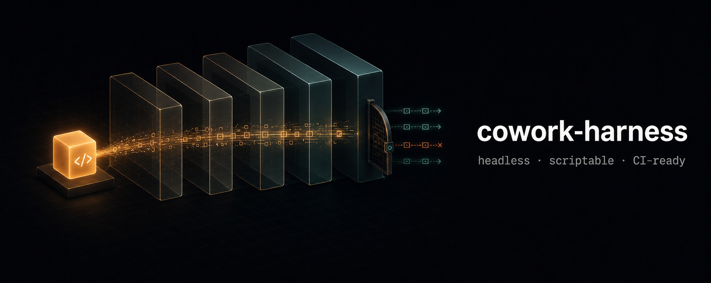

<p align="center">
  
</p>

# cowork-harness

[](https://github.com/yaniv-golan/cowork-harness/actions/workflows/ci.yml)
[](./LICENSE)
[](#quick-start)
[](#drive-it-from-claude-code-companion-skill)
[](https://github.com/yaniv-golan/skill-creator-plus)
[](https://agentskills.io)

Scriptable, CI-friendly test harness that reproduces **Claude Cowork's observable runtime contract** closely enough to test the skills you write — across many scenarios, headless, in CI — without the (locked) Desktop app. It reproduces not just Cowork's *behavior* but its *limitations*: sealed filesystem, default-deny egress, MCP-only cross-boundary — so a green test means green in real Cowork.

**Getting started:** [Why it works](#why-this-works-for-skill-testing) · [Quick start](#quick-start) · [Test a local skill](#test-a-local-skill-in-one-command) · [Fidelity tiers](#fidelity-tiers-pick-per-scenario--per-ci-job) · [Commands at a glance](#commands-at-a-glance)

**Reference:** [Session + scenario](#two-files-session--scenario) · [Sandboxing](#sandboxing-container-vs-the-real-vm) · [Discovery](#discovery-marketplaces-plugins-skills-mcp) · [What you get out](#what-you-get-out-inspectable-output) · [Architecture](#architecture) · [Testing & CI/CD](#testing--cicd) · [Maintenance](#maintenance-parity-between-releases) · [Limitations](#limitations) · [For AI agents](#for-ai-agents) · [Docs](#documentation) · [Versioning](#versioning) · [Status](#status)

**Debugging a run?** → [docs/debugging.md](./docs/debugging.md) — a separate page, not a section below.

> **Requirements at a glance** (a summary — full detail in [Prerequisites](#prerequisites-for-anything-above-protocol-fidelity) below)
> - **Free demo (`replay`):** Node ≥ 20 — nothing else (no Docker, token, or Claude Desktop).
> - **`lint` (optional, token-free):** also needs **`python3`** on PATH — the scenario linter shells out to it (PyYAML is bundled); a missing `python3` is a hard `exit 127`.
> - **Live tiers** need three things:
>   - **Claude Desktop, opened once** — stages the agent; nothing is bundled.
>   - **A Claude token** — real per-run cost, runs take minutes; mint one with `claude setup-token` (needs the **`claude` CLI**: `npm i -g @anthropic-ai/claude-code`).
>   - **A runtime** — **Docker (arm64)** for `container` (default) / `hostloop`, or **Lima (Apple-VZ)** for `microvm`.
>   - The `protocol` tier skips the runtime + the staged agent but still calls a real model, so it still needs the token. Run `doctor --tier <t>` to check exactly what a given tier needs.
> - **Platform:** best on **macOS Apple Silicon**; **Windows is not supported** for the live tiers (use the token-free `replay`); `sync` and `microvm` are **macOS-arm64 only**. Full detail in [Prerequisites](#prerequisites-for-anything-above-protocol-fidelity) below.

> **New here?** Start by running a committed cassette `replay` and browsing [`examples/`](./examples/) (see [examples/README.md](./examples/README.md)) to see green runs before any setup — then read [docs/boundary.md](./docs/boundary.md) (the limitations model) and [docs/session.md](./docs/session.md) (the file you'll author).

> **What this is and isn't.** This is an *emulator of the contract*, not the Desktop runtime: real Cowork runs your session inside an Apple Virtualization.framework microVM, and you **cannot** drive that microVM from a script (Cowork's session control plane is closed off; see [DESIGN.md §1](./DESIGN.md#1-what-real-cowork-actually-is-and-why-scripting-it-is-closed) for why). What you *can* faithfully reproduce is everything that actually changes how a **skill** behaves: the same agent binary in cowork mode (`CLAUDE_CODE_IS_COWORK=1` — there is no `--cowork` flag), the same mount layout, the same egress allowlist, and the same permission/question protocol. That's what this project does.

**Zero-friction preview — no token, no Docker.** A committed cassette replays from a fresh clone (the example
cassette ships in the repo; just Node ≥ 20):

```bash
git clone https://github.com/yaniv-golan/cowork-harness && cd cowork-harness
npm ci && npm run build
node dist/cli.js replay examples/replays/example-pdf-skill.cassette.json
```

(Installing globally — `npm install -g cowork-harness` — gives you the `cowork-harness` CLI for your own
scenarios and cassettes; the bundled example above is replayed from a checkout.)

Full setup → [Quick start](#quick-start).

---

## Why this works for skill testing

A skill's behavior under Cowork is determined by four things, all reproducible outside the VM:

| Dimension | What Cowork does | How we reproduce it | Fidelity |
|---|---|---|---|
| **Agent** | Spawns the staged in-VM agent `claude-code-vm/<ver>/claude` in cowork mode (`CLAUDE_CODE_IS_COWORK=1` env — there is no `--cowork` flag) | Run the **same pinned agent**, **bind-mounted** from your Claude Desktop install's staged Linux/arm64 ELF binary (the native Linux executable format; no npm path; override with `COWORK_AGENT_BINARY`) | **High** — same binary contract |
| **Mounts** | `/sessions/<id>/mnt/{uploads,<folder-name>,.local-plugins,.remote-plugins}` (work folders mount at the collision-resolved folder basename; ≥1.14271.0, older baselines use `.projects/<id>`) | Recreate the same paths as bind mounts; skill-under-test discovered at the plugin mount, same as Cowork | **High** — same discovery path |
| **Egress** | gVisor (a userspace network stack) with a compiled domain allowlist (`vmAllowedDomains()` + `coworkEgressAllowedHosts`) | Default-deny egress proxy enforcing the **synced** allowlist | **Med-High** — allowlist-exact, transport-approximate |
| **Permissions / questions** | `onToolPermissionRequest` → `respondToToolPermission`; AskUserQuestion answered by the UI | The **Agent SDK `can_use_tool` control protocol** — the exact same channel — answered by your scenario script | **High** — same protocol Desktop uses |

The permission/question protocol is the backbone, and it's the *most stable* surface — it's the documented Agent SDK control protocol (`can_use_tool`, `hook_callback`, `mcp_message`, …). Everything fragile (agent version, mount paths, allowlist contents) is pushed into a **versioned baseline** that you re-sync per release. See [Maintenance](#maintenance-parity-between-releases).

> **Design principle: fail loud, never silently wrong.** An unscripted question, a stale cassette, an unadded skill file, a missing capability — every one of these is a hard error or a loud warning, never a silent pass. Where you see "fails loud" or "no silent false-greens" elsewhere in this doc, it's this same principle applied to one specific mechanism.

---

## Quick start

**Install from npm:**

```bash
npm install -g cowork-harness    # puts the `cowork-harness` command on your PATH
```

**Or build from source:**

```bash
git clone https://github.com/yaniv-golan/cowork-harness && cd cowork-harness
npm ci && npm run build && npm link    # puts the `cowork-harness` command on your PATH
# …or skip the link and call it directly: node dist/cli.js <cmd>
```

**Then try it — one line, still no token, no Docker:**

```bash
# From a source checkout — works whether or not you ran `npm link` above:
node dist/cli.js replay examples/replays/example-pdf-skill.cassette.json
```

> **Installed globally instead?** Once linked/installed, the same command is `cowork-harness replay
> <cassette>` — but the relative path above only resolves from a source checkout's `examples/replays/`.
> From a global install (`npm i -g "cowork-harness@>=1.2.0"`), point at the package root instead:
> `cowork-harness replay "$(npm root -g)/cowork-harness/examples/replays/example-pdf-skill.cassette.json"`
> (or copy the cassette into your own project and pass that path).

Live `run`/`skill` need the prerequisites in the next section — note the `protocol` tier skips Docker and the staged agent but **still calls a real model** (via the host `claude`), so it needs the auth token.

> **Which path am I on?**
> - **Replay only (zero setup):** `cowork-harness replay <cassette>` — no token, no Docker, no agent. The command above.
> - **`protocol` (real model, no Docker):** needs only the auth token (item 3 below).
> - **Live `container` / `microvm` / `hostloop` / `cowork`:** needs Docker (or Lima for `microvm`), a staged agent, and the token — run `cowork-harness doctor` first.
> - **Invocation:** from a source checkout, `node dist/cli.js <cmd>` (or `npm link` to get the `cowork-harness` command); from a global install, `cowork-harness <cmd>`; the companion skill falls back to `npx "cowork-harness@>=1.2.0"`.

Two more worked examples worth knowing about: `examples/scenarios/protocol-smoke.yaml` (zero-Docker smoke
test) and `examples/scenarios/skill-loads.yaml` (container-tier acceptance check) — see
[examples/README.md](./examples/README.md).

> **Testing a local skill folder?** Untracked files are invisible to the mount (`git add` them first) — see
> [Test a local skill in one command](#test-a-local-skill-in-one-command) below for why.

### Drive it from Claude Code (companion skill)

This repo ships a **companion skill** (`.claude/skills/cowork-harness/`) that teaches an agent how to drive the harness — author scenarios, pick a fidelity tier, script answers, place assertions in the right CI lane, and avoid the "✓ passed ≠ correct" traps. **This is independent of the CLI install above** — `npm install -g cowork-harness` puts the CLI on your `PATH` but does not register anything with Claude Code; to use the skill *inside* Claude Code, install it separately via the bundled marketplace, either as slash commands in an interactive session:

```text
/plugin marketplace add yaniv-golan/cowork-harness
/plugin install cowork-harness@cowork-harness
```

or their shell equivalents (e.g. in a non-interactive setup script):

```bash
claude plugin marketplace add yaniv-golan/cowork-harness
claude plugin install cowork-harness@cowork-harness
```

The skill **self-bootstraps the CLI**: if `cowork-harness` isn't on your PATH it falls back to `npx "cowork-harness@>=1.2.0"` (a version floor that fails loud rather than silently fetching a too-old CLI; Node ≥ 20). Tiers above `protocol` still need Docker/Lima and a Claude Desktop agent binary — see the prerequisites below.

It also follows the open [Agent Skills](https://agentskills.io) spec, so it installs cross-editor (Cursor, Codex, OpenCode, …) via [`npx skills`](https://github.com/vercel-labs/skills) (Vercel Labs' CLI implementation of that spec):

```bash
npx skills add yaniv-golan/cowork-harness --skill cowork-harness
```

(Working *inside* this repo, the skill auto-loads as a project skill — no install needed.)

| What ships | npm global (`npm install -g cowork-harness`) | Source checkout (`git clone` + `npm ci`) |
|---|---|---|
| CLI, `scenario.py` + assertion keys (enough for `lint` in CI) | ✓ | ✓ |
| `SKILL.md`, all of `docs/`, `SPEC.md`/`DESIGN.md`/`AGENTS.md` | ✓ | ✓ |
| Committed replay fixtures (`examples/replays/`) | ✓ | ✓ |
| Runnable worked examples on disk (`examples/scenarios/`, `examples/skills/`, `examples/data/`) | ✗ | ✓ |

A global install is enough for CI `lint`, reading the teaching skill, and replaying the committed cassettes.
To `run` the worked examples live or copy them as a starting point, use a source checkout. (The marketplace
skill install itself only pulls `.claude/skills/cowork-harness/` — SKILL.md + `references/` + `scenario.py`/
assertion keys, per `.claude-plugin/marketplace.json`'s `source` — not the rest of this table; the full set
above becomes available once the skill's first command self-bootstraps `npx "cowork-harness@>=1.2.0"` — see
[above](#drive-it-from-claude-code-companion-skill) — which pulls the same npm package as the global-install row.)

### Prerequisites for anything above `protocol` fidelity

(The `protocol` tier skips items 1–2 — no Docker, no staged agent — but still calls a real model via the host `claude`, so it needs item 3, the auth token; only a committed-cassette `replay` needs nothing at all):

**Platform × tier support** (live tiers are **arm64-only** — there is no x86_64 container/microvm image):

| Tier | macOS arm64 | Linux arm64 | Windows | Runtime | Token |
|---|---|---|---|---|---|
| `replay` | ✓ | ✓ | ✓ | none | no |
| `protocol` | ✓ | ✓ | ✓ | none | yes |
| `container` | ✓ | ✓ | ✗ | Docker | yes |
| `microvm` | ✓ | ✗ | ✗ | Lima (Apple-VZ) | yes |
| `hostloop` | ✓ | ✗ | ✗ | Docker + native macOS agent | yes |
| `cowork` | ✓ | ✗ | ✗ | Docker + native macOS agent | yes |

So **Linux live == `container` only**: `microvm` is Apple-VZ (macOS), and `hostloop`/`cowork` need the native macOS agent binary. Linux `container` needs a staged Linux **ELF** agent (see the CI recipe below + [docs/maintenance.md](./docs/maintenance.md)); Windows is `replay`/`protocol` only.

1. **Claude Desktop, opened once.** The Cowork agent binary is **bind-mounted from your own install** at run time — nothing Anthropic-owned is bundled. Open Cowork once so the agent ELF is staged (`…/claude-code-vm/<ver>/claude`); the harness auto-detects it, or set `COWORK_AGENT_BINARY=<path>` to point at it. Without a staged agent, the sandboxed live tiers (container/microvm/hostloop/cowork) fail with "Open Cowork once to stage it…". (`protocol` and a committed-cassette `replay` need no staged agent.) For the `hostloop` tier specifically, a **second, separate native macOS binary** is required (`…/claude-code/<ver>/claude.app/Contents/MacOS/claude` — distinct from the container ELF above); the same "open Cowork once" step stages both, and `cowork-harness doctor --tier hostloop` checks for it explicitly.
2. **A runtime + agent image, matching your tier:**
   - **`container` / `hostloop` (Docker, arm64):**
     ```bash
     docker build --platform linux/arm64 -t cowork-agent-base:2 -f docker/Dockerfile.agent .
     ```
     This **core** image mirrors the real Cowork rootfs's document/data toolchain (Node 22, openpyxl/pandas/pdf/docx/pptx, …); override the tag with `COWORK_AGENT_IMAGE`. For OCR / LibreOffice / markitdown / opencv / PDF-table skills, build the **full-parity** image instead and point `COWORK_AGENT_IMAGE` at it:
     ```bash
     docker build --platform linux/arm64 --build-arg COWORK_FULL_PARITY=1 -t cowork-agent-full:2 -f docker/Dockerfile.agent .
     ```
     (A run on the core image that uses an omitted capability is flagged with a `missing_capability`
     verdict signal — see [`requires_capabilities`](./docs/scenario.md#declaring-required-capabilities-requires_capabilities)
     in docs/scenario.md, or the `COWORK_SKIP_CAPABILITY_PROBE` var under
     [Reproducibility knobs](#reproducibility-knobs) below.) Both `-f docker/Dockerfile.agent .` paths are **repo-relative** — run from a source checkout, not a global `npm install -g`. On a global install, run `cowork-harness doctor --tier container` instead — it prints the exact `docker build` command with the correct package-local Dockerfile path.
   - **`microvm` (Lima / Apple-VZ, no Docker):**
     ```bash
     brew install lima
     cowork-harness vm init   # one-time: provisions the Lima VM image
     ```
     `doctor --tier microvm` checks for Lima (not Docker) and warns — non-fatally — if `vm init` hasn't run yet (a live run self-provisions on first use, just with extra VM-boot latency).

> The `pytest` lane (`python/README.md`) has its own, slightly different prerequisite list (adds `pytest`
> + package importability) — see there if you're driving tests via `pytest` instead of the CLI directly.
3. **An auth token** — either `export CLAUDE_CODE_OAUTH_TOKEN=$(claude setup-token)` (the `claude setup-token` step needs the **`claude` CLI**: `npm i -g @anthropic-ai/claude-code`) or a **`.env`** file (copy `.env.example` → `.env`; gitignored). (`.env.example` lists all three accepted vars — `CLAUDE_CODE_OAUTH_TOKEN`, then `ANTHROPIC_API_KEY`, then `ANTHROPIC_AUTH_TOKEN` — in that precedence order.) The token resolves in priority order: exported env > `--dotenv <path>` > `./.env` (cwd) > `<install>/.env` (the package root), so a `npm link`ed install works from any directory. Keep `.env` at a working-dir or install root, never inside a mounted skill/project folder. (Use `--dotenv`, not `--env-file` — Node reserves the latter.) For a global `npm install -g` install, find the package root with `` `$(npm root -g)/cowork-harness` `` (e.g. `$(npm root -g)/cowork-harness/.env`) — or simpler, just use `--dotenv <path>` / `./.env` in your working directory, which take priority over the package root anyway.

> `sync` (below) is **optional for a first run** — the repo ships `baselines/desktop-*.json`, so `baseline: latest` already resolves. Run `sync` only to refresh the platform baseline after Claude Desktop updates. (`sync` is **macOS-only** today; on Linux/Windows use the committed baselines — they work cross-platform.)

> **Global install?** The only runnable `examples/` subtree a global install ships is `examples/replays/` (for token-free `replay`) — the `examples/scenarios/…` paths below need a **source checkout** (`git clone`); a global `npm install -g` omits `scenarios/`, `sessions/`, and `matrices/`, so `run examples/scenarios/…` errors with a missing file. (See the "What ships" table above for the full package contents; `package.json` `files`.)

```bash
# 0. Before the first live run: check prerequisites (Docker, staged agent, token, baseline).
cowork-harness doctor                      # read-only: what's present, what's missing (defaults to --tier container)
cowork-harness doctor --tier container     # same as bare `doctor` above — spell it out, or pick a different tier (microvm/hostloop/cowork)

# 1. (Optional · macOS-only) Sync a platform baseline from your installed Claude Desktop.
#    Skippable on a first run — the repo ships baselines; `baseline: latest` already resolves.
cowork-harness sync            # writes baselines/desktop-<appVersion>.json
cowork-harness sync --diff     # show what changed vs the committed baseline

# 2. Run a scenario (L1 container by default)
cowork-harness run examples/scenarios/example-pdf-skill.yaml   # minimal: plumbing only
cowork-harness run examples/scenarios/csv-metrics.yaml         # worked example: a real skill runs a bundled producer end-to-end
cowork-harness run examples/scenarios/csv-fx-normalize.yaml    # graceful degradation: the skill's network step is blocked, it falls back

# 3. Run every top-level *.yaml scenario (non-recursive; machine-readable results, CI-ready exit code)
cowork-harness run examples/scenarios/ --output-format json

# 4. Record a cassette once, then replay it deterministically (no token, no Docker)
#    (without --out, the cassette is named after the scenario — its `name:`, or the filename)
#    Commit cassettes under examples/replays/ (this repo) or cassettes/ (conventional skill-repo name).
cowork-harness record examples/scenarios/example-pdf-skill.yaml --out examples/replays/example-pdf-skill.cassette.json
cowork-harness replay examples/replays/example-pdf-skill.cassette.json

# Cassettes are COMMITTED fixtures — record against synthetic data, and gate them in CI:
cowork-harness verify-cassettes examples/replays/   # privacy scan (email/currency/domain/path/machine-inventory) + staleness; exit 1 = verified & failed, exit 3 = could not verify

# 5. Lint scenarios before committing (catches silent false-greens in assertion placement)
#    Needs python3 (the linter shells out to the bundled scenario.py; PyYAML is bundled. exit 127 if python3 is missing).
cowork-harness lint examples/scenarios/*.yaml
```

> **Privacy:** a cassette snapshots the transcript and the `outputs/` JSON bodies, so it's committed PII
> surface. Record against synthetic inputs; opt into record-time **redaction** with a `.cowork-redact.json`
> (verdict-preserving — `record` refuses to write if redaction would flip an assertion); and gate every
> commit with `verify-cassettes` (the always-on scan, `--allow <regex>` for synthetic/public names). See
> [docs/cassette.md](./docs/cassette.md).

> **What replay checks.** `replay` re-evaluates a scenario's `assert:` against the frozen recording, split
> into four buckets:
>
> | When | Assertions |
> |---|---|
> | Always | `transcript_*`, `tool_*`, `subagent_*`, `no_vm_path_file_op`, `dispatch_count_max`, `skill_triggered`/`no_skill_triggered`, `max_cost_usd`/`max_tokens`/`tool_calls_max`/`max_turns` (against the *frozen recording's* spend, not fresh spend — a live `run` catches a real budget regression), `max_tool_errors`, `max_redundant_tool_calls`, `skill_available`, `connector_available`, `skill_tool_used`, `compaction_occurred`, `all_tasks_completed`, `task_count_min`, `task_status`, `no_scratchpad_leak`, `present_files_called`, `result`, the verdict modifiers |
> | Only if the cassette carries `controlOut` | `question_asked`, `questions_count_max`, `gate_answers_delivered`, `gate_answer_count_min`, `hook_blocked`, `no_hook_blocked`, `vm_path_denied`, `path_denied`, `no_path_denied` |
> | Only if the cassette carries an `artifacts` manifest | `file_exists`, `user_visible_artifact`, `artifact_json`, `computer_links_resolve`, `computer_links_resolve_if_present`, `no_unexpected_files`, `input_unmodified` |
> | Always skipped (live-only) | `egress_*`, `expect_denied`, `no_delete_in_outputs`, `self_heal_ran`, `transcript_no_host_path`, `no_mcp_error`, `max_peak_rss_bytes`, `semantic_matches`, `no_lost_write_back` — keep these in a periodic live `run` |
>
> Authoritative list: `ALWAYS_CONTENT_KEYS` / `QUESTION_GATE_KEYS` / `MANIFEST_KEYS` (composed per-replay) / `LIVE_ONLY_KEYS` (excluded) in `src/run/cassette.ts`. Full per-key reference:
> [docs/cassette.md → Assertion table](./docs/cassette.md#assertion-table). Full rules/rationale:
> [docs/scenario.md → Which assertions survive replay](./docs/scenario.md#which-assertions-survive-replay-ci-placement).

**Drive it from pytest** — the `cowork` lane (see [`python/README.md`](./python/README.md)):
`@pytest.mark.cowork` + a `cowork` fixture over the `--output-format json` surface, selectable with
`-m cowork` (opt-in, beside your fast tests).

## Test a local skill in one command

> **First time here?** The commands below assume the `cowork-harness` CLI is installed and a token is set —
> see [Quick start](#quick-start) for both, and run `cowork-harness doctor` to check what's missing. For the
> zero-infra path (no Docker, no token), start with the token-free [`replay` demo](#quick-start).

The fastest path — point at a **local folder**, no repo, no `claude plugin install`, no marketplace, no version bump, no cache layers. The folder is copied **fresh into the session on every run**, so you edit and re-run and your changes are live immediately. (Inside a git repo it stages the **git-tracked** files — the fidelity boundary, since real Cowork installs from a repo and sees only committed files; so `git add` a brand-new skill or it would mount empty (staging is enough for local runs — committing matters only for what you publish). The harness now **hard-fails loudly** on a would-be-empty mount and **notices** excluded untracked files, rather than silently staging nothing — `COWORK_HARNESS_GITSET=0` copies untracked files instead.)

```bash
# Auth once — export it, OR put it in a .env file (resolved: env > --dotenv > ./.env > <install>/.env):
#   cp .env.example .env   &&   echo "CLAUDE_CODE_OAUTH_TOKEN=$(claude setup-token)" >> .env
export CLAUDE_CODE_OAUTH_TOKEN=$(claude setup-token)

cowork-harness skill ~/my-plugin 'Use my-skill to do X'                    # single-quote: no $ expansion
cowork-harness skill ~/my-plugin --prompt-file ./prompt.txt               # prompt verbatim (raw bytes)
cowork-harness skill ~/my-plugin "..." --answer "which format=Markdown"   # script AskUserQuestion
cowork-harness skill ~/my-plugin "..." --answer-policy policy.yaml        # reusable file of regex→choice rules
cowork-harness skill ~/my-plugin "..." --timeout 300000                  # wall-clock budget in ms; kills the agent on expiry
cowork-harness skill ~/my-plugin "..." --fidelity protocol                # fast, no sandbox
cowork-harness skill ~/my-plugin "..." --dry-run                          # resolve & print the launch plan, don't run
cowork-harness skill ~/my-plugin "..." --output-format json                      # machine-readable result on stdout
cowork-harness skill ~/my-plugin "..." --on-unanswered fail               # never fabricate an answer (CI/agents)
cowork-harness skill ~/my-plugin "..." --decider-cmd 'node answer.js'     # answer LIVE stochastic questions via a helper
cowork-harness skill ~/my-plugin 'review this deck' --upload deck.pdf      # attach a file → mnt/uploads (deck-review etc.)
cowork-harness skill ~/my-plugin "..." --session-id s1                     # pin a session…
cowork-harness skill ~/my-plugin '<next turn>' --session-id s1 --resume    # …then resume it (gated/checkpoint skills)
cowork-harness skill ~/my-plugin "..." --keep                            # keep the run dir, then: trace it
cowork-harness trace <run-id> --view tools                                # tool calls + sub-agent dispatches from events.jsonl
cowork-harness skill --help                                               # full per-command flag reference

cowork-harness chat ~/my-plugin                  # interactive multi-turn REPL (full harness: egress sandbox + control protocol)
# chat --raw  → native interactive cowork mode via `docker run -it` (needs Docker + the arm64
#               cowork-agent-base:2 image; the egress sandbox is NOT applied in --raw)
# chat also writes a result.json (mode:"chat", no pass/fail verdict) — so a chat session now shows up in `stats`/`trace`/`scaffold` too
```

**Input policy — no silent false-greens.** When an AskUserQuestion arrives with no scripted
`--answer`, the policy is explicit: `fail` (error + the exact `--answer` to add, plus a note that a
scenario can instead set `on_unanswered: llm` as a secondary escape valve for a gate whose wording
drifts run-to-run — the default for `run`/CI), `prompt` (ask at the TTY — the default for `skill`
when interactive), or `first` (pick
option 1, loudly warn). Pick with `--on-unanswered`; left unset, `skill` is **adaptive** (`prompt` on
a TTY, `fail` when piped/CI) and `run` is always `fail`. Exit codes: `0`
pass · `1` assertion/agent failure · `2` usage / unanswered-under-`fail` / runtime · `3` boundary/integrity.
Exceptions worth knowing:

- the `boundary-check` **command**'s own probe failures follow the assertion convention and exit `1` (see SPEC.md §11);
- `verify-cassettes` reuses exit `3` with a different meaning — "could not verify" (vs. a verified failure's `1`); see the command table;
- exit `4` is reserved on the `run`/`skill` family (SPEC §11).

After a run, the footer **echoes every auto-answered
question as a copy-pasteable `--answer "<q>=<choice>"` line** — run once exploratorily, then paste them
back to lock in a deterministic re-run.

**Output.** `skill` renders the agent's work (assistant text + tool calls) plus a metered footer — you
see *what it did*, not just a green; `run` is verdict-first but prints the failing transcript inline on a
`FAIL` (no spelunking `runs/…`). Human-readable output goes to stderr, machine output to stdout, so
`--output-format json` always pipes cleanly; it honors `NO_COLOR` too.

| Flag | Effect |
|---|---|
| `--quiet` | Verdict only |
| `--verbose` | + thinking blocks, tool inputs, sub-agent tree |
| `--compact` | Drops informational `[capability]` notices (the probe + its hard-fail safety net still run) — for shareable screenshots/GIFs |
| `--demo` | `--compact` + hides the `runs →` host-path header (runs still land in the durable location, so `scaffold`/`trace` still work) + collapses `$HOME` → `~` — leaks no host paths |
| `--output-format json` | Stable machine envelope on stdout: `{tool, version, command, ok, results[], error}`; each result carries `verdict: {pass, exitCode, signals[], guards[], failures[]}` so you can read per-result pass/fail **and why** without recomputing; errors are `{ok:false, error:{category,message,hint}}`. This is the shape for the main `results[]`-bearing commands (`run`/`skill`/`record`/`replay`) — several other commands use a dedicated or payload-shaped envelope instead (and some, like `chat`, emit no stdout JSON envelope); see [SPEC §11](./SPEC.md) for the per-command breakdown by envelope family |

**Test a specific local plugin version** — just point at the folder at that version (it's copied fresh — git-tracked files inside a repo; no install, no version bump). Add more with `--plugin`:
```bash
cowork-harness skill ~/my-plugin "..." --plugin ~/other-plugin
```

**Test a specific local marketplace version** — point at the marketplace dir (the one with `.claude-plugin/marketplace.json`); the harness reads its `marketplace.json` and **mounts** the referenced plugins at the Cowork plugin path (passing `--plugin-dir`) — the marketplace registry is inert in cowork mode, so there is no `claude plugin marketplace add`, clone, or cache:
```bash
cowork-harness skill --marketplace ~/my-marketplace --enable my-skill@my-marketplace "Use my-skill"
```

It mounts the folder(s) at the Cowork plugin path, runs the staged agent in cowork mode, and prints PASS/RESULT (add `--keep` to print the run dir, or `--output-format json` for the machine-readable result). No YAML to author. (Author `scenarios/*.yaml` only for repeatable, asserted regression tests.)

---

## Fidelity tiers (pick per scenario / per CI job)

```
L0  protocol-only     claude -p stream-json (the agent's JSON-lines I/O format) on the host. No sandbox,
                      no egress control. Fastest. Pure-logic / inner-loop assertions.

L1  container parity  Pinned agent in cowork mode inside an arm64 Linux container with the real
   (recommended)      mount layout and a default-deny egress proxy enforcing the synced allowlist.
                      Reproducible, CI-native (Docker/Podman). The faithful-yet-maintainable sweet spot.

L2  microvm parity    Optional. Agent inside a real Linux microVM (Lima/Apple-VZ) with a guest
   (opt-in, heavy)    default-deny iptables firewall funnelling to the same allowlist proxy as L1.
                      VM-grade escape isolation; egress transport equals L1's HTTP-CONNECT proxy (the
                      HTTP tunneling method used for HTTPS-through-a-proxy) — no gVisor netstack
                      reproduced. Not for CI; periodic high-fidelity checks only.

    ─── loop-mode overlays (orthogonal to L0/L1/L2: they pick WHERE the loop runs, not isolation) ───

    hostloop          Cowork's PRODUCTION split-execution. The agent loop is a NATIVE process spawned
                      directly on the host (no container around the file tools, matching production) —
                      native Bash/WebFetch are disabled and routed host-side via the workspace SDK-MCP
                      server — an in-process MCP server the Agent SDK talks to directly (tool name
                      mcp__workspace__bash), whose bash calls route into a Docker VM sidecar; web_fetch
                      routes via host curl. A PreToolUse path-containment hook is the security boundary
                      for real filesystem access at this tier — see docs/boundary.md.

    cowork            Auto-picks hostloop vs container the way Cowork itself does — decoded from
                      GrowthBook gate 1143815894 (Cowork's internal feature-flag system) in the
                      synced baseline. "Do what real Cowork does."
```

**Decision guide** — `fidelity:` takes exactly one of these five values (`protocol`/`container`/`microvm` vary isolation strength; `hostloop`/`cowork` are overlays that instead pick *where the loop runs* — there's no combining the two groups):

| Question | Choose |
|---|---|
| Is the skill logic / gate flow even alive? | `protocol` |
| Does it behave under Cowork's mounts + egress? | `container` (default) |
| Need VM-grade escape isolation for untrusted code? | `microvm` — not for CI, macOS arm64 only |
| Bug only shows in the production host/VM split? | `hostloop` — live-only, macOS only, needs the native binary |
| Want it auto-picked the way Cowork itself picks, this release? | `cowork` — resolves to `hostloop` or `container`, never `protocol`/`microvm` |

Note: `cowork` above is one value of `fidelity:`. Two other `cowork`-named settings are unrelated —
`permission_parity: cowork` (a session setting for how unscripted tool calls are treated; see
[Two files: session + scenario](#two-files-session--scenario)) and "cowork mode" (the
`CLAUDE_CODE_IS_COWORK=1` env flag every live tier passes to the agent binary, regardless of which
fidelity tier you picked).

Recorded cassettes pin the tier a `fidelity: cowork` scenario actually resolved to as `effectiveFidelity`, which backs the `resolved-tier`/`unverifiable-tier` staleness classes — see [docs/cassette.md](./docs/cassette.md).

Set the tier with `fidelity:` in a scenario or `--fidelity` on `skill` or `chat`.

---

## Commands at a glance

Skill testing is the headline use, but the tool is a general harness over the Cowork runtime. Run any command with `--help` for its full flag reference.

| Command | What it does | Reach for it when… |
|---|---|---|
| `skill <folder> "<prompt>"` | Run a local skill/plugin folder once against the staged agent; `--compact`/`--demo` trim output for shareable screenshots/GIFs; `--ablate-skill` runs the same prompt with the skill removed (a negative control for skill-lift) | ad-hoc "is the skill alive / does it do X?" — the fast inner loop |
| `run <scenario.yaml \| dir/>` | Run authored scenarios with `assert:` + a CI-ready exit code; a decider can answer unscripted gates; `--repeat`/`--matrix` add variance runs / a compatibility matrix (detail below); `--ablate-skill` runs the same prompt with the skill removed (a negative control for skill-lift) | you want a repeatable, **asserted regression test** — to **measure flakiness** instead of trusting one green — or to **test a compatibility matrix** (multiple baselines/models/skill variants) in one run |
| `chat <folder> [prompt]` | Interactive multi-turn REPL against a skill (TTY); optional seed prompt is sent as the first turn. `--upload <file>` / `--folder <dir>` (repeatable) attach files/project folders; `--verbose` shows thinking blocks + tool inputs; `--fidelity protocol\|container\|hostloop` (no `microvm`/`cowork` in the REPL); `--allow-host-writes` consents to a writable `hostloop`-fidelity connected folder (same consent as clicking "connect folder" in Desktop); `--raw` skips the control protocol for native `docker run -it` (rejects `--upload`/`--folder`/`--plugin`/`--fidelity`) | debugging a multi-turn flow by hand |
| `record` / `replay` | **Record a live run once → replay it token-free, Docker-free thereafter** (key flags below; `replay --explain` prints the evidence behind every passing assert) | **token-free, Docker-free CI** from a once-recorded run |
| `verify-cassettes <file\|dir>` | Token-free CI gate over committed cassettes: a privacy scan (email/currency/domain/path/machine-inventory) + a staleness check (allowlist and skip flags below); a dir argument scans `*.cassette.json` non-recursively | gating **committed cassettes** against PII leaks + "edited the skill, forgot to re-record" |
| `verify-run <run-dir> <scenario.yaml>` | Re-evaluate a scenario's `assert:` (and, when the scenario declares `answers:`, whether they still match the run's actual gates) against an already-kept run dir — **no live agent, no tokens, no Docker** (~1s) | iterating on a wrong assertion or a drifted `answer` without a full live re-record |
| `trace <run-id>` | Digest a run's `events.jsonl` (`--view tools\|questions\|dispatches\|tool-durations\|tool-errors\|files\|usage`; `--translate-paths` rewrites VM paths to host paths in the text `tools`/default views) | "how many sub-agents *actually* dispatched, and which?" — per-tool call/timing stats with `--view tool-durations`, full stderr per failed call with `--view tool-errors`, a workspace-file diff with `--view files`, or per-model token/cost with `--view usage` |
| `inspect <run-id>` | Show what a run **produced**: the artifacts + a shallow field preview of each JSON artifact (`--output-format json` for a digest). Works on a salvaged partial run too | "did it do the job?" — without hand-parsing `…/mnt/outputs/…` |
| `scaffold <run-id>` | Turn a kept run into a starter scenario YAML (gates→answers, artifacts→`file_exists`) | authoring a scenario from a real run instead of guessing |
| `python3 …/scenario.py scaffold --name <name> --skill <dir>` | Generate a starter scenario skeleton from scratch (the `…` is `.claude/skills/cowork-harness/scripts/`) | starting a new scenario when you have no prior run |
| `lint <scenario.yaml \| dir/>…` | Check scenarios for silent false-greens — assertions placed on the wrong CI lane, mixed content/live keys, missing `controlOut`-required keys (files or a directory of `*.yaml`/`*.yml`; bundled `scenario.py`; needs python3 — PyYAML is bundled); `--json` emits findings as machine-readable JSON instead of the text report | before committing a new scenario or after changing assertions |
| `lint-skill <SKILL.md \| skill-dir/>…` | Lint a skill body (and any sibling `hooks.json`) for two Cowork host-loop footguns — a `${CLAUDE_PLUGIN_ROOT}` path used in an in-VM bash context, and a hook command that exports an env var or writes into `/tmp` for the in-VM agent — plus static resolution of any pinned `subagent_type` against the enclosing plugin's `agents/*.md` (bundled `scenario.py`; needs python3); the two footguns are WARN-only, and of the three `subagent_type` outcomes, an in-plugin-prefixed agent missing from the enclosing plugin's fully-enumerated `agents/*.md` (`subagent-type-not-found-in-plugin`) is a **provable typo and is WARN too**, while a cross-plugin (`subagent-type-unresolvable`) or unknown-bare (`subagent-type-unknown`) value stays INFO (no built-in agent-type registry to disprove it against) — pass `--strict` (the CI-recommended invocation; plain `lint-skill` is advisory-only) to fail on any WARN, or `--json` for machine-readable findings | authoring or reviewing a skill before a paid Cowork host-loop run exposes the footgun, or before a pinned `subagent_type` typo breaks a `Task` dispatch |
| `python3 …/scenario.py resolve-agent-types <plugin-dir> [--json]` | Token-free: print a plugin's valid `<plugin>:<agent>` subagent types, resolved from `.claude-plugin/plugin.json` + `agents/*.md` frontmatter (filename-stem fallback when an agent file has no `name:`); the `…` is `.claude/skills/cowork-harness/scripts/` | "does `founder-skills:deck-review` resolve within this plugin?" without a live dispatch |
| `analyze-skill <SKILL.md \| skill-dir/ \| glob>…` | Token-free ADVISORY scan: flags a `/sessions/...` path handed to a file tool or used as a dispatch/sub-agent output path — that path class is DENIED on host-loop. Accepts multiple positionals (files, dirs, or a simple `*`/`**` glob), walked recursively across a plugin's `SKILL.md`/`agents/`/`references/`/`commands/`. Findings print but exit 0 by default; `--strict` (the CI-recommended invocation) fails on any unsuppressed finding. Three per-file ignore markers (`ignore-next-line`, `ignore-start`/`ignore-end`, file-wide `ignore`) and a `--output-format json` payload are supported. **It also flags interactive-artifact write-backs lost under Cowork**: it statically analyzes `.html`/`.js`/`.ts`/`.py` sources under the target for a relative `fetch`/XHR/`sendBeacon`/`<form method=post>` write-back that silently fails when the artifact is served from Cowork's own origin (`artifact-write-back-lost` gates under `--strict`; `artifact-write-back-suspect` is advisory; a candidate that can't be parsed is a could-not-verify exit `3`). `--runtime` adds an optional headless-DOM confirmation (needs `jsdom`) that *observes* the lost write-back. Full reference — ignore-marker syntax, directory-walk rules, JSON shape, and the artifact detector: [docs/subagents.md](./docs/subagents.md#static-path-fidelity-check-analyze-skill) | catching the exact "skill hands `/sessions/...` to a file tool" defect — or an artifact whose Submit silently fails under Cowork — statically, before paying for a live run to discover it |
| `probe-dispatch <skill-dir> "<prompt>"` | Cheap single-dispatch mechanics probe: a THIN wrapper over `skill` (fidelity `container`/`microvm`/`hostloop`, default `hostloop`) that scopes a prompt to trigger ONE `Task` dispatch, then prints just that dispatch's `{resolvedAgentType, pathDenials, delivered}` — no new data model, a pure projection of the same `RunResult` `skill` already produces; `--expect-write <suffix>` narrows `delivered`; "one dispatch" is prompt-scoped, not enforced (`--output-format json` for machine consumption); also inherits the common decider/answer flags — `--decider-cmd`, `--decider-dir`, `--on-unanswered`, `--ablate-skill` | "did THIS dispatch resolve to the type I expect, avoid a path denial, and actually deliver its write?" without hand-writing a scenario or reading `trace --view dispatches` |
| `assertions --list` | List the available scenario assertions (generated from the schema) | "what can I assert?" without grepping the source |
| `decide` | Validate a decider against a sample question in ~2 s (no run) | sanity-check a `--decider-*` / `--answer` wiring before a long run |
| `gates` / `answer` | Stream / answer in-band gates for `--decider-dir` | a **driving agent** answers live questions via a Monitor |
| `status <run-id \| run-dir> [--follow]` \| `status --latest-for <scenario>` | Check whether a background run is alive (state/elapsed/tool counts) by reading `status.json` — no `ps aux` needed (unreliable across sandbox/PID-namespace boundaries). Pointing it at a run-dir **root** (no `status.json` of its own) resolves to the newest session under it (scanned up to two levels deep) instead of failing with "no status.json". `--follow` streams one line per change until done/error; staleness detection catches a `SIGKILL`'d process. `--latest-for <scenario-name-or-slug>` resolves and prints the NEWEST run dir for a scenario by actual run time (its `.origin`/`result.json` timestamps) — NOT `ls -td`'s directory mtime, which can return a stale prior-session dir | a **driving agent** (or script) checking on a run it launched in the background, or locating the run it just kept |
| `stats [<scenario>]` | Queryable summary over every indexed `run`/`skill`/`record` invocation — run count, pass rate, cost/duration/token/turn p50/p95, last-green timestamp (filters and `--reindex` below). See [docs/stats.md](./docs/stats.md) | "is this scenario flaky/expensive over time?" without hand-aggregating `result.json` files |
| `boundary-check [baseline] [--session <file>]` | Prove the **L1 Docker** sandbox enforces Cowork's limitations (sealed FS + default-deny egress; `container`/`hostloop` share this sandbox — `microvm`'s guest firewall is not probed here); `--session` folds a session's `egress.extra_allow` into the probe allowlist | verifying the harness's own fidelity |
| `sync` / `list` | Derive/refresh (`sync [--diff] [--allow-empty\|--force]`) & list platform baselines from the Desktop install | after Claude Desktop updates (baselines ship, so it's optional otherwise) |
| `diff <a> <b>` | Compare two baselines, two runs, two cassettes, or a run+cassette — kind auto-detected by content (view/normalization flags below). Token-free, no live Desktop/Docker needed | "what changed between two runs/cassettes/baselines?" |
| `doctor [--tier <t>]` | Read-only prerequisite check, per tier (Docker + agent image for `container`/`hostloop`/`cowork`; **Lima** for `microvm`; plus staged agent, token, baseline); prints the exact `docker build` line if the agent image is missing | "can I run the live tiers — what's missing?" before a first live run |
| `prune [<runs-dir>] [--keep-last <n>] [--pinned-older-than <N>d\|h\|m]` | Prune accumulated run dirs (keeps the N most recent per scenario; pinned `--session-id` runs are never pruned unless `--pinned-older-than` opts in to reclaiming stale ones by last-activity age); the optional positional overrides the runs root; `--dry-run` | the machine-global runs root has grown and you want space back |
| `rehash <dir/>` | Migrate cassette fingerprints to the current format version when the content is provably unchanged (`--dry-run`); no re-record needed | a cassette-format bump flagged committed fixtures as stale |
| `init-redact [--force]` | Copy the packaged reference `.cowork-redact.json` (local-path prefixes + a generic email regex) into the cwd; refuses to overwrite without `--force`. Review + tailor before recording | `record` warned that a `hostloop`/`protocol` recording has no redaction policy |
| `vm <init\|status\|delete\|prune>` | Manage the L2 Apple-VZ / Lima microVM (`prune` removes orphaned VMs left by config/agent-version changes) | running `--fidelity microvm` |

**Flags worth knowing** (the full list is always `<command> --help`):
- `run`: a decider (`--decider-cmd <helper>`/`--decider-dir <dir>`, or a scenario's `on_unanswered: llm` — a scenario-YAML key, not a CLI flag; `run` rejects `--on-unanswered llm`) can answer unscripted gates; `--repeat N` (2-100) runs each scenario N times and aggregates a variance rollup instead of a single pass/fail (`--min-pass-rate`, `--stop-on-diverge`, `--max-budget-usd` tune the batch verdict/loop); `--matrix <matrix.yaml>` runs ONE scenario across the cross-product of baseline/model/skill_dir axes (worked example: `examples/matrices/csv-metrics-matrix.yaml`; `--max-cells`/`--concurrency` tune the cap/pool — any cell failing, assertion or infra, fails the run); `--compact`/`--demo` trim `run`/`skill` output for shareable screenshots/GIFs.
- `record`/`replay`: `replay --explain` prints the evidence trail behind every passing assert (the flagship false-green tool — text mode; `--output-format json` already carries `assertions[].evidence`); `--decider-llm`/`--decider-dir` answer gates live during recording; `--rerecord-stale`/`--concurrency <N>` batch re-record; `--assert-from <scenario.yaml>`/`--reassert` re-check the on-disk `assert:` instead of the frozen one; `--strict`/`--fail-on-skill-drift` control staleness handling on replay; `--no-redact` skips record-time redaction; `--allow-failing` relaxes the post-run verdict gate; `--dry-run` resolves without recording; `--force` overrides the refusal to overwrite a default-path cassette that belongs to a *different* scenario (a slug collision) — not a general overwrite-anything flag; `replay --best-effort-future-cassette` lets a cassette from a newer format version replay anyway (warn instead of the default hard error).
- `verify-cassettes`: privacy scan (email/currency/domain/path/machine-inventory) + staleness — exit 1 when verification RAN and found a real problem (a finding, a genuine drift, or scenario-prompt drift), exit 3 when it could NOT complete (an unverifiable-class staleness finding, a too-new cassette format, or a read error); whole-token allows via `--allow <regex>` (a pattern) / class-scoped `--allow-domain` / `--allow-email` / `--allow-path` / `--allow-machine-inventory` / `--allow-patterns-file <path>` (a **file** of patterns, one regex per line); `--skip-privacy` or `--skip-staleness` runs only part of the gate; a diverged scenario `prompt` vs. the cassette's frozen prompt is also a hard fail (its own `scenarioDrift` bucket), opt out with `--skip-scenario-drift`; `--margins` adds a per-cassette recorded-vs-budget report for count-bound assertions (a single-sample estimate — diagnostic only, never changes the gate verdict).
- `stats`: reads `<runsRoot>/index.jsonl`, written automatically at every result; `--since`/`--baseline`/`--branch` filter; `--last <n>` windows per-scenario; `--reindex` rebuilds the index from the physical run-dir tree (the migration path for pre-index runs).
- `diff`: `--changelog` renders known-field prose for a baseline diff; `--view tools|transcript|artifacts|meta` narrows a run/cassette diff to one section; normalization (default on) masks per-run noise (ids/timestamps/session markers/host paths) so two runs of the same scenario diff as identical — `--no-normalize` compares raw values.

There's also a **Python `cowork` pytest lane** (`python/`) for driving any of this from `pytest` beside your normal tests — see [`python/README.md`](./python/README.md).

---

## Two files: session + scenario

Configuration splits the way Cowork itself splits — *what you set up before the first prompt* vs. *what you ask*:

- **Session setup** (`sessions/*.yaml`) — everything you'd configure in Cowork's pre-prompt setup: model, effort (`low|medium|high|xhigh|max`, per-model; `extra` is accepted as an alias for `xhigh`), extended thinking (on/off), permission mode, **mounted work folders / projects**, uploaded files, and **discovery** (marketplaces, plugins, skills, MCP servers). Hand-authored, one per project, reused across scenarios.
- **Scenario** (`scenarios/*.yaml`) — the prompt, the **scripted answers**, and the assertions. References a session.

> **Worked examples to copy** live under [`examples/`](./examples/) (see [examples/README.md](./examples/README.md)). `examples/skills/csv-metrics/` + `examples/sessions/csv-metrics.yaml` + `examples/scenarios/csv-metrics.yaml` is a complete, non-trivial skill running end-to-end: the agent loads the skill, runs its **bundled producer** (`scripts/metrics.py`, stdlib-only so it works under default-deny egress), and writes a structured `outputs/metrics.json` + a `outputs/summary.md`. The scenario asserts the structure (skill loaded, producer ran, artifacts exist); the paired [`python/test_csv_metrics_lane.py`](./python/test_csv_metrics_lane.py) adds a predicate over the JSON content (`assert_artifact_json`). Read those files to see the whole loop — discovery → run → deliverable → assert — that every real skill follows. (`examples/scenarios/example-pdf-skill.yaml` is the minimal counterpart: harness plumbing, placeholder skill.)
>
> **Worked example #2 — graceful degradation under the sealed network.** `examples/skills/csv-fx-normalize/` + `examples/scenarios/csv-fx-normalize.yaml` shows the property you can *only* test by running against the real boundary: the skill's job needs the network (fetch an FX rate to convert EUR→USD), Cowork's default-deny egress blocks it, and the skill **falls back to source currency instead of crashing or hanging**. Its `egress_denied: api.frankfurter.app` assertion is backed by a *real* fetch the skill makes — not a synthetic probe — and `result: success` + the delivered artifact prove the fallback. This is the right way to assert egress: cause a genuine denial through real behavior.

```yaml
# scenarios/pdf.yaml   ← the filename is the test's identity (name: is an optional override)
baseline: latest                       # platform baseline (auto-synced from Desktop)
session: ../sessions/default.yaml     # pre-prompt setup, resolved relative to THIS file
fidelity: container                   # protocol | container | microvm | hostloop | cowork

prompt: |
  Summarize report.pdf and write the action items to outputs/actions.md

# Scripted answers — the can_use_tool control channel, same as Desktop's question UI
answers:
  - when_question: "Which output format"   # regex (case-insensitive) on AskUserQuestion
    choose: "Markdown"                      # by label; or choose: "2" for the 2nd option BY POSITION
                                            # (index survives label drift but NOT option re-ordering — prefer a
                                            # label when order is stable; `lint` advises on positional choose;
                                            # ".*" matches any phrasing — last-resort, single gate/turn, after specific rules)
  - when_tool: Bash                        # tool-permission decisions
    allow_if: "!command.includes('rm -rf')"
    else: deny
  - when_tool: Write
    decide: allow

expect_denied: ["evil.example.com"]       # assert this host is denied egress

assert:
  - transcript_contains: "action items"
  - user_visible_artifact: outputs/actions.md   # the robust primitive — also catches connected-folder deliverables that file_exists (mnt/-anchored) misses
  - tool_called: Write
  - egress_denied: evil.example.com
  - result: success
```

```yaml
# examples/sessions/default.yaml  (abridged — see the file for every field)
# Relative paths below resolve from THIS file's dir (absolute and ~ are used as-is).
model: claude-opus-4-8
effort: high                            # low | medium | high | xhigh | max (extra = alias for xhigh) — validated against the model
extended_thinking: true                 # on/off toggle (default on). debug.max_thinking_tokens is a fenced, non-Cowork override
permission_mode: default
permission_parity: cowork                   # cowork (allow unscripted tool calls, the default) | strict (deny unscripted)
folders:
  - { from: ~/code/myproject }              # a work folder / Space -> mnt/myproject (collision-resolved basename)
uploads:
  - ~/Downloads/report.pdf                  # -> mnt/uploads
plugins:
  marketplaces: ["https://github.com/anthropics/claude-code.git"]
  # local_marketplaces: ["../my-marketplace"]  # LOCAL marketplace dirs (each with a marketplace.json)
  local_plugins: ["../skills/my-pdf-skill"] # mounted at mnt/.local-plugins/marketplaces/local-desktop-app-uploads/<name>
  enabled: ["my-pdf-skill@local"]           # name@marketplace: a local_plugins entry is referenced as <plugin>@local
mcp:
  config: ../data/mcp.json                  # standard mcpServers map (--mcp-config) — the way to attach an MCP server
egress:
  extra_allow: ["api.github.com"]
```

Multiple scenarios × sessions × platform baselines = your regression matrix. Drop YAML in `scenarios/` and CI runs them all.

## Sandboxing: container vs. the real VM

Cowork runs the agent in an **Apple Virtualization.framework microVM** (separate kernel). The harness's default `container` tier uses an OS container (shared kernel, namespaces/cgroups). For **testing skills you wrote**, that's faithful where it counts — same agent binary, same cowork mode, same mount layout, same egress allowlist, same permission protocol — because skill behavior is agent-loop + tool behavior, all kernel-invisible. The container is the right default precisely because it's CI-native; a VM needs nested virtualization most shared CI runners don't have.

It only *matters* to use a real VM when you're testing **isolation of untrusted skills** (container escape is easier than VM escape), or a skill that probes kernel internals. For that, the `microvm` tier runs the same agent in a real Linux microVM via **Lima with `vmType: vz` — the same Apple Virtualization.framework Cowork uses** (highest off-app fidelity). This tier is **macOS arm64 only** (it needs Apple's hypervisor); there is no Linux/Firecracker path. The launch contract is identical to the container tier; only the isolation boundary differs — egress is the same allowlist proxy as the container tier (no gVisor netstack at any harness tier). See [DESIGN.md — Architecture at a glance](./DESIGN.md#architecture-at-a-glance).

## Discovery: marketplaces, plugins, skills, MCP

The agent we run **is** `claude-code` (the same binary Cowork stages in `claude-code-vm/<ver>`), so it discovers extensions from the same roots — verified against the staged binary:

| Kind | Real root | How the harness populates it | Override |
|---|---|---|---|
| Plugins / marketplaces | `CLAUDE_CONFIG_DIR/plugins`, `plugin_marketplaces` + Cowork mounts `.local-plugins/marketplaces/<marketplace>/<plugin>` (≥1.14271.0; older baselines use `.local-plugins/cache`), `.remote-plugins` | session `plugins.local_plugins`/`remote_plugins` → mounted at those paths; `marketplaces`/`local_marketplaces`/`enabled` → `settings.json` | point `plugins.config_dir` at a test dir |
| Skills | `CLAUDE_CONFIG_DIR/skills` + skills inside plugins | session `skills.local` staged into the config dir; plugin skills discovered at the mount | swap the config dir or local dirs |
| MCP servers | `.mcp.json` / `--mcp-config`, `enabledMcpjsonServers` | session `mcp.config` → `--mcp-config`; `mcp.enabled` → `settings.json` | use a test `mcp.json` |

The harness builds a **clean managed `CLAUDE_CONFIG_DIR` per run** (with a generated `settings.json`) so discovery is hermetic and reproducible — nothing leaks from your real `~/.claude`. Pin `plugins.config_dir` to a fixed dir if you want to reproduce a specific real setup instead.

> Fidelity note: in real Cowork, stdio MCP servers run **host-side** (split execution — the VM shell is sealed, host MCP servers get full env). At the `container` tier the harness runs them alongside the agent for simplicity; if your skill depends on that host/VM split, document it as an unreproduced gap — `microvm` runs MCP inside the guest too, so no harness tier reproduces the split.

---

## What you get out (inspectable output)

Every run writes to `~/.cowork-harness/runs/<scenario>/<sessionId>/` (out of any working tree; relocate with the global `--run-dir <path>` flag — it goes *before* the subcommand — or `COWORK_HARNESS_RUNS_DIR`). A `chat` run instead writes to `runs/chat/<sessionId>/` — the first path segment is the literal `chat`, not a scenario name:

```
events.jsonl        full stream-json event log (child→driver; the cassette source)
control-out.jsonl   driver→child control_responses (the other cassette half)
run.jsonl           harness-observability log for the LATEST turn: decisions (+who decided),
                    sub-agent dispatch tree, egress, transcript, cost, and a `turn` number
                    (replaces transcript.json/decisions.jsonl)
run.turn-<N>.jsonl  prior turns of a resumed (--session-id + --resume) session, preserved so an
result.turn-<N>.json  earlier turn's transcript/result isn't clobbered by the next (both only present
                    after a resume; the live run.jsonl/result.json carry a `turn` number)
trace.json          structured run trace: steps, questions, sub-agents, egress, decisions, cost
egress.log          raw allow/deny per outbound connection (microvm: at top level; container: under
                    proxy/ — the allow/deny decisions are also folded into run.jsonl/result.json)
result.json         assertion results + decisions + sub-agents + cost/usage + exit status +
                    gate provenance + tool/model timing & errors + skill/task/context panels +
                    workspace file inventory + egress & resource telemetry (see "Observability
                    fields" below)
agent.stderr.log    the agent process's stderr (auth errors, flag rejects)
```

Secrets (the injected OAuth token / API key) are scrubbed from every persisted log by value.

**Observability fields** — `result.json` carries a lot more than the basics above:

- **Timing & model:** `toolDurations` (per-tool call count / total / max ms), `models` (distinct model ids seen) — `trace <id> --view tool-durations` renders these as a table.
- **Tool health:** `toolErrors` (per-tool call/error counts), `redundantToolCalls` (wasted repeated `{name,args}` calls), `thinking` (reasoning blocks, capped at the last 50 — on newer models like Opus 4.8/Sonnet 5 the API omits thinking text by default, so blocks arrive as `{text:"", redacted:true}`; read that as "reasoned, text omitted by request", not "no reasoning"), `modelUsage` (per-model tokens/cost/cache, denormalized from the SDK's own field). Don't conflate the three per-tool rollups: `toolCounts` is a flat `{tool: number}` call-count map, `toolErrors` is `{tool: {calls, errors}}`, and `toolDurations` is `{tool: {calls, totalMs, maxMs}}`. `trace <id> --view tool-errors` renders one row per errored tool call with the full multi-line stderr (capped 4KB), vs. the 120-char preview `--view tools` shows.
- **Verdict:** `verdict` — a kept run's overall `{pass, exitCode, signals, guards, failures}`, the same `computeVerdict` source that also drives the run/skill exit code, the footer, and the JSON envelope's `ok`; persisted and streamed verdict are one shape, so they can never diverge. `failures[]` names the failing assert key (when a failure traces to one) or the hard-verdict guard reason (an infra error, an unanswered gate, a scan-based host-path leak, …) otherwise. `jq '.verdict' result.json` answers "did it pass, and why" without re-running `verify-run`. Scope: the run/asserted lane only — `chat` carries no assertions and no verdict, so the field is absent there. (New in 0.31.0.)
- **Sub-agents & skills:** `subagents[]` now also carries `prompt`, `dispatchModel`/`resolvedModel` (the dispatch-input vs binary-resolved model), `output`, and `attributedSkillId`; `skillActivity[]` attributes tool calls to whichever skill was active when they ran; `referencesRead[]` lists the skill's `references/*`/`scripts/*` files the agent's **main agent** actually **Read** (a progressive-disclosure signal — `SKILL.md` is delivered whole so it never appears, `assets/` is untracked; present on live and replay). `subagents[].referencesRead` is the per-dispatch counterpart, tracking a **sub-agent's own** reference/script Reads (new in 0.31.0) — top-level `referencesRead[]` remains main-agent-only.
- **Panels:** `context` (available tools/mcpServers/skills), `tasks[]` (the agent's to-do list), `workspaceFiles[]` (every user-visible file, classified `output`/`mount`/`input`, with size + sha256). `trace <id> --view files` renders `workspaceFiles[]` as a class-grouped tree plus a diff against `preRunHashes` (added/modified/removed/unchanged); needs a run dir. `trace <id> --view usage` renders per-model tokens/cost/cache-read ratio from `modelUsage`; also needs a run dir.
- **Runtime signals:** `hookEvents` (PreToolUse block/allow decisions), `mcpErrors` (failed MCP round-trips), `contextEvents` (incl. context-compaction boundaries), per-request `egress` detail (method/path/port/bytes + deny reason), `resources` (peak RSS, avg/peak CPU% — live lane only), `errorSource`/`stderrLogPath` (crash triage), `preRunHashes` (pre-run file hashes backing in-place-mutation checks), `resultErrorKind` (`transport`/`agent`/`usage_limit` — a usage/quota-limit failure is a spent quota surfaced distinctly, so a batch or CI job can halt-fast and retry after reset instead of treating it as a skill regression).
- **Execution location:** `execution` — `{location:"local"|"cloud", environmentId?, taskKind?:"interactive"|"scheduled"}`, orthogonal to `fidelity` (a local privilege tier). Stamped `location:"local"` on every locally-executed run; absence is **not** a "local" signal — it means a pre-taxonomy result or the error-replay lane, not a positive local claim.
- **Provenance & evidence health:** `command` records the exact command that produced the result (`run`/`skill`/`record`/`chat`/`replay`) — finer than `mode` (`skill` and `record` both report `mode:"run"`), so a rebuilt run index can tell them apart. On replay, `fingerprint.frozen: true` marks the shown staleness fingerprint as the cassette's record-time value, not a fresh recompute. `evidenceErrors` counts dropped/malformed lines per telemetry stream (`taskTracking`, `webSearchParse`, `presentFilesMalformed`, `egressParse`); a non-zero count makes the dependent assertion fail evidence-unavailable rather than grade a partial signal. A dispatch's `output` and a matched result's `assertText` carry companion `outputTruncated` / `assertTextTruncated` flags when cut at the assert cap, so a substring miss against truncated evidence is reported unverifiable, never a proven absence.

`cowork-harness assertions --list` is the full, always-current catalog built on these fields (e.g. `input_unmodified`, `tool_no_error`, `max_tool_errors`, `max_redundant_tool_calls`, `skill_tool_used`, `subagent_output_contains`, `all_tasks_completed`, `task_status`, `skill_available`, `connector_available`, `tool_available`, `hook_blocked`, `no_hook_blocked`, `no_mcp_error`, `compaction_occurred`, `max_peak_rss_bytes`); see [docs/scenario.md](./docs/scenario.md) for the same catalog with descriptions.

`input_unmodified` accepts either a glob array or a single glob string (`input_unmodified: 'uploads/**'`), and can guard uploaded files as well as connected-folder inputs — uploads are captured as a read-only input root (hash-only in cassettes, never inlined), so a mutation to an uploaded file is attributed to the agent instead of silently passing.

**Gate provenance** — `result.json` carries a `gateProvenance` block recording, per AskUserQuestion gate, *how* it was answered — `scripted`, `decided(llm|external)`, `first-option`, or `prompt` — with a `bySource` histogram and per-gate `{question, answeredBy, answer, model?}`. The verdict footer shows a counts-only one-liner and `trace <id> --view questions` annotates each gate with its `by`/`model`, so you can see which assertions sit downstream of a non-reproducible (decided) gate:

```
✓ success [container] · 4 tools · 12.3s ⚠ non-deterministic (LLM-decided)
   gates: 3 · 2 decided(llm), 1 scripted
   → result: ~/.cowork-harness/runs/my-scenario/s1/result.json
```

It is informational — it never changes the verdict. The block is a live/`partial`-lane surface (absent on the replay lane, which reports reproducibility via `nonDeterministic: false`). The `→ result:` pointer itself prints on every kept run (success or failure) since the run directory is always retained on disk — it's suppressed only on the replay lane, which never writes a `result.json`.

**Debugging a run** — when a run misbehaves or a green looks too good to trust, [docs/debugging.md](./docs/debugging.md) is the map: `inspect` → `trace` → `verify-run` → `diff` → `chat` for a misbehaving skill, and the false-green hunt for a green you don't trust. `replay --explain` is the flagship false-green tool: it prints the evidence trail behind every passing assert (which link resolved, which file matched, which value satisfied a bound), text mode only (`--output-format json` already carries `assertions[].evidence`).

---

## Architecture

```
                      ┌────────────────────────────────────────────────┐
  scenario.yaml ────► │  cowork-harness  (TypeScript CLI)              │
                      │    baseline loader ◄── baselines/desktop-*.json│
                      │    runtime selector  ──►  L0 / L1 / L2         │
                      └───────────────────────┬────────────────────────┘
                                              │  spawns + speaks stream-json
                      ┌───────────────────────▼────────────────────────┐
                      │  Agent:  claude -p   (CLAUDE_CODE_IS_COWORK=1) │
                      │    --input-format / --output-format stream-json│
                      │    cwd = /sessions/<id>/mnt                    │
                      │    mnt/uploads · mnt/<folder-name> · plugins   │
                      └───────────────────────┬────────────────────────┘
            decision control request          │  outbound network (egress)
            (tool · question · dialog)        │  default-deny → allowlist
                      ┌───────────────────────▼────────────┐    ┌────────────────────────┐
                      │  AgentSession ──► Decider ──► Run  │    │  Egress proxy          │
                      │  protocol · policy · turn loop     │    │  default-deny;         │
                      │  + RunRecord                       │    │  allowlist = synced    │
                      │                                    │    │  vmAllowedDomains()    │
                      └────────────────────────────────────┘    └────────────────────────┘
```

> The diagram above shows the VM-loop path (`container`/`microvm`). At `hostloop` fidelity the agent loop
> instead runs as a native host process with no container around it, routing shell/file access through a
> workspace SDK-MCP server into a VM sidecar — see the Spawn contract section in DESIGN.md for detail.

- **AgentSession** speaks the Agent SDK control protocol over stream-json, emitting a typed event
  stream. When the agent emits a decision request (a tool permission, an `AskUserQuestion`, or a
  `request_user_dialog`/`elicitation`), the **Decider** resolves it — scripted `answers:` first, then
  the cowork/strict permission default, then the `on_unanswered` policy (fail/prompt/first) — and
  **Run** drives the turn loop and builds the `RunRecord` (decisions, the sub-agent dispatch tree,
  egress, cost).
- **Egress proxy** (L1/L2) enforces the synced allowlist; default-deny. Domains come from the baseline, plus per-scenario `extra_allow`.
- **The platform baseline** is the single source of release-specific truth. Code rides the stable protocol; data tracks the release.

See [DESIGN.md](./DESIGN.md) for the full parity matrix, the known deltas vs. real Cowork, and the threat-model notes on egress.

---

## Testing & CI/CD

The harness is built to *be* your skills' test suite, and it ships with its own. Two layers:

### Your skills' suite

Author scenarios in your own `scenarios/` dir, run the lot, get a non-zero exit on any failure:

```bash
cowork-harness run scenarios/            # your repo's scenarios; runs every *.yaml/*.yml, CI-ready exit code
```

### Packaged GitHub Action

The fastest path to CI: a composite action wrapping the token-free lane, with a PR job-summary reporter.

```yaml
- uses: yaniv-golan/cowork-harness@main
  with:
    command: replay              # replay | lint | lint-skill | analyze-skill | verify-cassettes | run
    path: cassettes/my-skill.cassette.json
```

| Lane | Commands | Runner requirements | What you get |
|---|---|---|---|
| **Token-free** (the headline lane) | `replay`, `lint`, `lint-skill`, `analyze-skill`, `verify-cassettes` | any `ubuntu-latest` | deterministic, no Docker, no API key, no agent binary — this is what most skill repos want. `lint`/`lint-skill` are thin passthroughs to the bundled `scenario.py` (python3, preinstalled on `ubuntu-latest`); `analyze-skill` is pure TS (no python3 needed) |
| **Live** (`command: run`) | `run` | Docker + a provisioned agent binary + `anthropic-api-key` input | real inference against a live scenario — the action does **not** provision the agent binary or build the image for you (see [Fidelity tiers](#fidelity-tiers-pick-per-scenario--per-ci-job) below and the agent-binary provenance runbook in [`docs/maintenance.md`](./docs/maintenance.md)); this is for a self-hosted runner that already has both staged, not a stock GitHub-hosted runner |

**Live lane, by design not oversight:** the action never downloads or stages the agent ELF itself.
Pulling Anthropic's binary is a call about your own relationship with their distribution terms, so it
stays a step in *your* workflow, not something a third-party action automates for you. A self-hosted-runner
example:

```yaml
jobs:
  live:
    runs-on: [self-hosted, linux, arm64]   # needs Docker + the ELF staged below; not stock GitHub-hosted
    steps:
      - uses: actions/checkout@v4
      - name: Stage the agent binary (official channel, sha256-verified — see docs/maintenance.md)
        run: |
          V=2.1.209   # match your scenario's pinned baseline's agentVersion
          curl -fSL "https://downloads.claude.ai/claude-code-releases/$V/linux-arm64/claude" -o "$RUNNER_TEMP/claude-$V"
          chmod +x "$RUNNER_TEMP/claude-$V"
          echo "COWORK_AGENT_BINARY=$RUNNER_TEMP/claude-$V" >> "$GITHUB_ENV"
      - uses: yaniv-golan/cowork-harness@main
        with:
          command: run
          path: scenarios/
          anthropic-api-key: ${{ secrets.ANTHROPIC_API_KEY }}
```

Every run writes a Markdown verdict table (scenario, pass/fail, signals, cost/turns when available, staleness findings, and the replay-skipped-assertions honesty line) to the job summary. Inputs: `command`, `path` (required), `version` (npm dist-tag/version, default `latest` — intentional so recipes track the current release; pin an exact version for reproducible CI. The companion skill's `cowork-harness@>=1.2.0` floor guidance applies to ad-hoc CLI installs, not this input), `strict` (applies to `replay` (staleness findings), `lint`/`lint-skill` (WARN/INFO), and `analyze-skill` (any advisory finding); IGNORED — not forwarded — for `verify-cassettes`/`run`, which don't accept the flag), `fail-on-skill-drift` (**`replay`-only** — never forwarded to the analyzers), `extra-args`, `summary` (default `true`), `anthropic-api-key` (live lane only). See [`action.yml`](./action.yml) for the full input reference.

The provided [GitHub Actions workflow](.github/workflows/ci.yml) runs a **six-stage pipeline**. The **unit** stage is the token-free gate you can copy into your skill repo; the `action-self-test`, `python`, `boundary`, `scenarios`, and `parity-drift` stages are this repo's own fidelity self-tests and are not directly portable (they build the harness's Docker image and run harness-specific e2e scenarios — see [`ci-recipe.md`](./.claude/skills/cowork-harness/references/ci-recipe.md) for the skill-repo template):

| Stage | Runs | Needs | Gates |
|---|---|---|---|
| **unit** | format check · typecheck · unit tests · build · CLI smoke · token-free `replay` · `verify-cassettes` · `lint` | nothing | every push/PR |
| **action-self-test** | packs this commit and runs the packaged `uses: ./` Action against the committed example-pdf-skill cassette (pass case) + a nonexistent path (fail case) | nothing | every push/PR |
| **python** | `pytest` helper self-checks (`python/`, run with `-m 'not cowork'` — the token-free subset; the Docker/token `@pytest.mark.cowork` tests are excluded) | nothing (token-free assertions only) | every push/PR |
| **boundary** | builds the pinned agent image, brings up the default-deny network, runs `boundary-check`, then `npm run test:live` (live contract tests that guard the binary-resolution assumptions, no token needed) | Docker, arm64 runner | proves the sandbox enforces Cowork's limits — **no API key** |
| **scenarios** | the live scenario suite (mixed `protocol` + `container` fidelity across `examples/scenarios/`), plus the `e2e/scenarios/*.yaml` smoke set (this repo's own L0/L1/hostloop self-tests, `microvm` excluded — needs a real VM); uploads transcripts/egress logs as artifacts; relies on a runner-local staged agent binary (no in-workflow download step). | `ANTHROPIC_API_KEY` | fork PRs: the whole job is skipped (`if:` guard); same-repo without a key: warns and exits 0 |
| **parity-drift** | reminder to re-`sync` when Desktop updates | nothing | **fails CI** if the newest committed baseline is &gt; 90 days old |

This ordering means cheap checks fail fast, the **boundary parity gate runs without secrets** (so forks get it too), and expensive live runs only happen when a key is present.

CI uses `ANTHROPIC_API_KEY` specifically because there's no interactive browser available to run
`claude setup-token`'s OAuth flow in a GitHub Actions runner; locally, the OAuth token is preferred because
it mirrors what Desktop itself uses (no separate API-billing setup).

### The harness's own suite

```bash
npm run ci            # typecheck + build + test (Stage 1 locally; run format:check separately)
npm test              # vitest: decider, egress allowlist, launch plan, example validation
cowork-harness boundary-check   # Stage 2: self-verify the sandbox (needs Docker)
```

Unit tests cover the scripted-answer logic, the egress allowlist matcher, the session→launch-plan materialization (mounts + discovery settings + env-strip), and a **schema guard** that fails if any shipped baseline/session/scenario stops validating. Add a test alongside any new schema field or `Decider` rule — see [CONTRIBUTING.md](./CONTRIBUTING.md).

> Copy your starting scenarios/sessions from **`examples/`**. The **`e2e/`** directory is the harness's *own* fidelity self-tests (smoke scenarios per tier) — not a template to copy.

### Reproducibility knobs

Most runs need **none** of these — the defaults are correct. They're grouped by theme below (container/runtime, networking/loop, strictness, staleness, secret-scrubbing, L2 microVM, `skill`/`chat` defaults); reach for one only when a default doesn't fit. Every var name is `COWORK_*` / `CLAUDE_*`, so a search across this section finds it fast.

- `COWORK_LOCKDOWN=off` — relax container hardening for debugging (default `on`). With it `on`, an L2 microVM whose guest egress firewall fails to apply **aborts loudly** rather than running un-isolated.
- `COWORK_CONTAINER_RUNTIME=podman` — use Podman instead of Docker.
- `COWORK_AGENT_IMAGE=<tag>` — override the agent image name (default `cowork-agent-base:2`); `COWORK_AGENT_BINARY=<path>` — override the auto-detected staged agent ELF; `COWORK_HOST_AGENT_BINARY=<path>` — override the auto-detected staged **native macOS** agent binary the `hostloop` tier spawns directly (distinct from `COWORK_AGENT_BINARY`, the container ELF). `COWORK_HARNESS_VERIFY_AGENT_SHA=0` — skip the default sha256 integrity check of the resolved agent ELF against the baseline's recorded hash (on by default).
- `COWORK_SKIP_CAPABILITY_PROBE=1` — skip the per-run capability probe (the harness otherwise probes the agent image/VM for the document/OCR/Office capabilities the real Cowork rootfs ships and **fails a run that uses one the image omits** — a likely false negative; suppress per-scenario with `allow_missing_capability: true`, or rebuild full parity).
- `COWORK_HARNESS_DECIDER_MODEL` — the default `--decider-llm` answering model (overridden by the `--decider-model` flag; falls back to the Sonnet default — pin a cheaper model for simple gates to cut cost). `COWORK_HARNESS_DECIDER_DIR_POLL_MS` / `_TIMEOUT_MS` — tune the `--decider-dir` rendezvous poll/backstop (poll defaults: 300 ms for the run-side rendezvous, 500 ms for `gates --follow`); `COWORK_HARNESS_DECIDER_CMD_TIMEOUT_MS` / `COWORK_HARNESS_LLM_TIMEOUT_MS` — backstop a hung `--decider-cmd` helper / `--decider-llm` model call (default 600 s, fail loud); `COWORK_HARNESS_LLM_RETRIES` — bounded retries for a transient non-zero `claude -p` exit in the `--decider-llm` transport (default 2, clamped to 0–10; set `0` to disable, e.g. deterministic CI; a usage/quota-limit exit is treated as non-retryable and bypasses this budget — retrying a spent quota is futile); `COWORK_HARNESS_LLM_MAX_BYTES` — stdout cap on a `--decider-llm` model call (default 8 MiB, fail loud past it); `COWORK_HARNESS_DIALOG_TIMEOUT_MS` — override the 6 s dialog auto-cancel.
- `COWORK_HARNESS_JUDGE_MODEL` — the default model for `semantic_matches`' LLM judge (overridden by a
  per-assertion `judge_model`; falls back to the pinned default `claude-opus-4-8`). Pin it alongside `judge_model` for a
  reproducible before/after comparison across re-records.
- `COWORK_HARNESS_RUNS_DIR` (or the `--run-dir <path>` flag — a **global** flag that must precede the subcommand, like `--dotenv`) — override the default run-output root `~/.cowork-harness/runs` (kept out of any working tree so sensitive skill inputs/outputs don't land in a repo). Precedence: `--run-dir` > env > default. The root is flat and machine-global (shared across projects); pinned `--session-id` runs are guarded against cross-project overwrite, and `prune` never prunes them. In CI, set it to a workspace path (e.g. `runs`) so artifact upload can collect the runs. `COWORK_HARNESS_ALLOW_FOREIGN_RESUME=1` overrides the guard that blocks `--resume` onto another project's pinned session.
- **Networking / loop:** `COWORK_EGRESS_PROXY` overrides the egress-proxy URL injected into the sandbox; `COWORK_PROXY_IMAGE` overrides the egress proxy Docker image name (default `cowork-egress-proxy:2`); `COWORK_DOCKER_NETWORK` pins the Docker network the agent container joins; `CLAUDE_FORCE_HOST_LOOP=1` forces the host-loop path regardless of the baseline's loop decision (the `cowork` tier's auto-pick). `COWORK_LIMACTL` overrides the `limactl` binary path (default `/opt/homebrew/bin/limactl`).
- `COWORK_HARNESS_PRERUN_HASH_CAP` — override the default cap on pre-run file hashing (bytes); raise it if `input_unmodified`/`no_unexpected_files` report evidence unavailable on a large connected folder.
- `COWORK_HARNESS_MAX_ARTIFACT_BYTES` — override the inline-artifact-body cap (default 65536 bytes;
  same knob as `record --max-artifact-bytes`, which takes precedence) so a large structured deliverable
  stays replay-checkable instead of being truncated.
- **Status/resource polling:** `COWORK_HARNESS_STATUS_INTERVAL_MS` — how often `status.json` is
  refreshed during a run (default 5000ms). `COWORK_HARNESS_STATUS_POLL_MS` / `_FIRST_SEEN_TIMEOUT_MS` /
  `_STALE_MS` / `_CORRUPT_TIMEOUT_MS` tune `status --follow`'s polling/timeout/staleness/corrupt-file thresholds (see
  [docs/run-status.md](./docs/run-status.md) for the full reference). `COWORK_HARNESS_RESOURCE_INTERVAL_MS`
  tunes the resource sampler's polling cadence (default 1000ms; an invalid value warns and falls back to
  the default rather than silently sampling on the wrong cadence — see
  [docs/maintenance.md](./docs/maintenance.md)).
- `COWORK_HARNESS_NO_HYPERLINKS` — disable OSC-8 terminal hyperlinks in CLI output (auto-disabled outside a TTY, under CI, or with `--compact`/`--demo`).
- **Strictness escape hatches** (the harness fails loud by default): `COWORK_HARNESS_SOFT_MISSING=1` downgrades a missing mount source from a hard error to warn-and-exclude; `COWORK_HARNESS_ALLOW_CONFIG_DIR_WRITE=1` permits writing into an existing pinned `plugins.config_dir` (otherwise refused, to avoid clobbering a real Claude config).
- **Staleness boundary** (the git-tracked-files-only default and its `git add`/hard-fail rationale are explained in [Test a local skill](#test-a-local-skill-in-one-command)): a **non-repo** source dir falls back to a raw walk instead; OS-junk like `.DS_Store` is always excluded; a partial exclusion emits a `::notice:: [stage]`. `COWORK_HARNESS_GITSET=0` opts out to a raw walk for every dir (and copies untracked files too); `COWORK_HARNESS_DEBUG_SKILLHASH=1` dumps the exact file set feeding the staleness hash on a mismatch (and flags OS-junk) so a drift source is one line. Declare per-plugin non-runtime paths in a `.cowork-hashignore` file (or the session `staleness.hash_ignore`). `COWORK_HARNESS_AGENT_SCOPE=skill` (opt-in) refines a scenario's `skills:` scope so a **skill-named** `agents/<name>.md` re-stales only that skill's cassettes instead of the whole fleet (generic agents stay shared; stamped into the fingerprint, so flipping it is a one-time re-record like `GITSET`).
- **`skill` / `chat` defaults:** `COWORK_HARNESS_FIDELITY` sets the default fidelity tier for ad-hoc `skill`/`chat` runs (a `--fidelity` flag or a scenario's `fidelity:` still wins); `COWORK_HARNESS_MODEL` sets the default model; `COWORK_HARNESS_OUTPUT_FORMAT` (`text`|`json`) sets the default output format. Each is overridden by the matching explicit flag. **Caveat:** `chat` only accepts `protocol`/`container`/`hostloop` — `microvm` and `cowork` are rejected (no Lima/auto-pick plumbing in the interactive REPL), so a `COWORK_HARNESS_FIDELITY` set to either is rejected loudly for `chat` even though `skill` accepts the full tier set.
- **Secret scrubbing:** `COWORK_HARNESS_SCRUB_KEYS=<KEY1,KEY2>` adds extra env-var names whose values are redacted from logs (beyond the known auth tokens + `ANTHROPIC_CUSTOM_HEADERS`); `COWORK_HARNESS_SCRUB_VALUES=<v1,v2>` redacts literal values regardless of env. **Committed-cassette redaction:** `COWORK_HARNESS_REDACT_PATTERNS=<rx1,rx2>` / `COWORK_HARNESS_REDACT_KEYS=<k1,k2>` extend the privacy layer that scrubs recorded `controlOut` before a cassette is written for commit.
- L2 microVM: `COWORK_VM_GATEWAY` overrides the Lima host-proxy gateway IP (default `192.168.5.2`); `COWORK_VM_PROXY_PORT` pins the egress-proxy port (unset, the host binds an OS-assigned free port and threads that same value into the guest firewall + `HTTP(S)_PROXY`). The Lima instance is named `cowork-vm-<config-hash>` (a config change → a fresh VM); `COWORK_LIMA_INSTANCE` pins a fixed name, and `vm prune` removes orphaned ones.
- **Advanced / internal escape hatches** (rarely needed): `PYTHON` overrides the interpreter for `lint` / scenario tooling (default `python3`); `COWORK_HARNESS_DEBUG=1` surfaces which `.env` files were loaded; `COWORK_HARNESS_CLAUDE_BIN=<path>` points the `--decider-llm` transport at a specific `claude` binary; `COWORK_HARNESS_ALLOW_AGENT_FALLBACK=1` lets the harness use the newest sibling agent binary when the baseline-pinned version is missing (a fidelity compromise — off by default) — a same-major.minor **patch** bump of the staged NATIVE binary is auto-accepted without this flag (the native binary carries no sha256 pin, so a patch drift is safe by default; it prints a loud stderr note naming the pinned and substituted versions). At `hostloop`, and at `cowork` **only when it resolves to host-loop** on the synced baseline, the staged **VM ELF** is auto-accepted on a patch bump too, because on that path it's a non-executed parity mount into the bash sidecar; a `cowork` baseline that resolves to VM-loop instead executes the ELF directly, so it keeps the strict sha-pinned exact-version match, same as `container`/`microvm`, which always keep it (the ELF is the executed agent there), so the flag remains required for any ELF drift on those tiers/paths, and for a major/minor gap everywhere; `COWORK_MANAGED_CONFIG=1` forces the managed-config path on `protocol`; `COWORK_HARNESS_ALLOW_MISSING_PROMPT=1` downgrades a missing prompt asset to a warning; `COWORK_HARNESS_SAFE_STAGING_PREFIX=<a,b>` whitelists prefixes under which a delete in `outputs/` is allowed (otherwise delete-in-outputs fails loud); `COWORK_HARNESS_NO_HEARTBEAT=1` disables the idle-run heartbeat, `COWORK_HARNESS_HEARTBEAT_MS` tunes its interval (default 30000ms / 30s); `COWORK_HARNESS_CLI=/path/to/cli.js` overrides which built CLI the Python `cowork` pytest lane drives (see python/README.md).
- Pin `baseline: desktop-<ver>` and `model:` in a session for byte-stable runs; use `latest` to track.

## Maintenance: parity between releases

This is the part built for longevity. The fragile, release-specific facts live in **one JSON baseline**; the orchestration code rides the stable stream-json protocol.

When a new Claude Desktop ships:

```bash
cowork-harness sync --diff
```

`cowork-harness sync` reads your **live install** and the **app.asar** and re-derives the baseline:

| Baseline field | Source (auto-detected) |
|---|---|
| `agentVersion` | `~/Library/Application Support/Claude/claude-code-vm/.sdk-version` |
| env-strip list | `app.asar` main bundle (BG env-strip — env vars the background-agent spawn scrubs before launch) |
| `mountLayout` | `app.asar` (`{uuid,name,mountPath,hostPath}` model) |
| `egress.allowDomains` | `app.asar` `vmAllowedDomains()` + `firewallAlso` + `config.json:coworkEgressAllowedHosts` |
| `networkMode` | `config.json:coworkNetworkMode`, asar `vm_network_mode` |
| `requireFullVmSandbox` | `config.json:lastSeenRequireCoworkFullVmSandbox` |

The diff shows exactly what moved (agent bump, allowlist change, new mount). You review, commit the new `baselines/desktop-<ver>.json`, and the container pin updates automatically from the baseline. Parity drift then surfaces as **test diffs**, not silent rot.

> The sync script is the maintenance contract. If an Anthropic release changes something the sync script doesn't yet read, `sync --diff` flags an `unknown delta` from the asar fingerprint so you know to extend it — rather than parity quietly degrading.

---

## Limitations

- **Not the full Desktop network transport.** L1 is a container, not a VM; L2 *is* a real Apple-VZ microVM but still does not reproduce Cowork's gVisor netstack — its egress is the same allowlist proxy as L1 (with a guest iptables firewall in front). If your skill depends on VM-kernel specifics, validate at L2; if it depends on packet-level gVisor behavior, no tier reproduces it.
- **Cowork in-guest context is partial.** Desktop supplies host-loop staging, runtime `mountPath` RPC, and the bridge. We reproduce the *filesystem and cowork mode*, not those host-side services. Skills that call Desktop-only host RPCs won't run here (they wouldn't be portable anyway).
- **The agent binary is the staged ELF** (`claude-code-vm/<ver>/claude`), **bind-mounted** from your own Claude Desktop install — nothing Anthropic-owned is bundled or installed. There is **no npm path**; override the path with `COWORK_AGENT_BINARY`. Check licensing/ToS for your use.
- **Egress fidelity is allowlist-exact, transport-approximate** at L1 and L2. Domain allow/deny matches Cowork; the packet-level gVisor netstack is reproduced at neither — both use a default-deny allowlist proxy (L2 adds a guest iptables firewall).

These are documented per-tier in [DESIGN.md](./DESIGN.md) so a green test means what you think it means.

---

## For AI agents

This repo is built to be driven by agents, not just read by humans:

- **[AGENTS.md](./AGENTS.md)** — the canonical agent-instructions file (architecture seams, the build gate, invariants, ethos). Read it before changing code. Also indexed in **[llms.txt](./llms.txt)**.
- **Companion skill** — [`.claude/skills/cowork-harness/`](./.claude/skills/cowork-harness/SKILL.md) teaches an agent to drive the harness; install it via the marketplace (see [above](#drive-it-from-claude-code-companion-skill)).
- **Machine-readable interfaces** — stable `--output-format json` envelope on stdout, deterministic exit codes (`0`/`1`/`2`/`3`, with a couple of documented per-command exceptions — see [SPEC.md](./SPEC.md) for the full table), and `--help` on every command.
- **JSON Schemas** — [`schema/scenario.schema.json`](./schema/scenario.schema.json) and [`schema/session.schema.json`](./schema/session.schema.json) describe every field of the YAML you author (generated from the source schemas; `npm run schema`). [`schema/protocol.v1.json`](./schema/protocol.v1.json) (hand-authored) schemas the harness's own control-channel wire protocol, with a golden vector pack at [`fixtures/protocol/v1/`](./fixtures/protocol/v1/) — see [docs/protocol.md](./docs/protocol.md).

`AGENTS.md`, `SPEC.md`, and `DESIGN.md` **are** shipped in the npm package (see `package.json` `files`) —
a global install has them locally too, not just on GitHub.

---

## Documentation

| Doc | Read it for |
|---|---|
| [docs/README.md](./docs/README.md) | The docs index — a one-line map of every guide below. |
| [docs/boundary.md](./docs/boundary.md) | The limitations model — sealed FS, default-deny egress, MCP-only crossing; how each tier enforces it; how to verify. |
| [docs/session.md](./docs/session.md) | Every `sessions/*.yaml` field and its Cowork mapping. |
| [docs/scenario.md](./docs/scenario.md) | `scenarios/*.yaml` — prompt, scripted answers, assertions. |
| [docs/subagents.md](./docs/subagents.md) | The sub-agent capability/path model — tier-qualified outputs contract, tool-composition rules, the type-less dispatch trap. |
| [docs/chat.md](./docs/chat.md) | The interactive `chat` REPL — multi-turn debugging, flags, attaching files/folders. |
| [docs/debugging.md](./docs/debugging.md) | Debugging a run — `inspect`/`trace`/`verify-run`/`diff`/`chat` for a misbehaving skill; the false-green hunt for a green you don't trust. |
| [docs/cassette.md](./docs/cassette.md) | `record`/`replay` cassettes — what replay checks, which assertions are skipped. |
| [docs/run-status.md](./docs/run-status.md) | Checking whether a background run is alive — the `status.json` file + `cowork-harness status [--follow]`. |
| [docs/stats.md](./docs/stats.md) | The `stats` command + `index.jsonl` — querying pass rate, cost/duration/token/turn percentiles, and last-green across every past run. |
| [docs/gotchas.md](./docs/gotchas.md) | Troubleshooting FAQ — exit 127, empty skill mount, arm64 Docker issues, git-worktree token traps, scenarioDrift after an edit, plus skill-authoring/host-loop footguns. |
| [docs/fidelity-gaps.md](./docs/fidelity-gaps.md) | The known deltas vs. real Cowork — what the harness does and doesn't reproduce. |
| [docs/decider-dir.md](./docs/decider-dir.md) | The `--decider-dir` recipe — a driving agent answers live gates in-band via `gates`/`answer` + a Monitor. |
| [docs/discovery.md](./docs/discovery.md) | Where plugins/skills/MCP are found + overrides. |
| [docs/plugin-root.md](./docs/plugin-root.md) | How `${CLAUDE_PLUGIN_ROOT}` resolves per execution mode (host-loop vs VM-loop) — for when a skill's bundled-file path doesn't resolve. |
| [docs/maintenance.md](./docs/maintenance.md) | Parity across Desktop releases via `sync`. |
| [docs/cowork-spawn-contract-1.12603.1.md](./docs/cowork-spawn-contract-1.12603.1.md) | The binary-grounded spawn/control contract (cwd, env, mounts, control-protocol fields) the harness implements. |
| [docs/decisions/](./docs/decisions/) | Architecture decision records — the "why" behind a cross-cutting default. |
| [DESIGN.md](./DESIGN.md) | Architecture deep-dive + full parity matrix. |
| [SPEC.md](./SPEC.md) | The authoritative testable contract (scenario/session schema, `RunResult`, exit codes). |
| [docs/invariants.md](./docs/invariants.md) | A consolidated index of the harness's cross-cutting invariants, one row per invariant with its enforcement point and test anchor. |
| [docs/protocol.md](./docs/protocol.md) | The `schema/protocol.v1.json` control-channel wire-protocol schema — versioning policy, golden vector pack, and its descriptive-not-normative scope. |
| [CHANGELOG.md](./CHANGELOG.md) | Release history. |
| [python/README.md](./python/README.md) | The `cowork` pytest lane for driving the harness from Python. |
| [examples/README.md](./examples/README.md) | The worked examples to copy — sessions, scenarios, and skills you can run end-to-end (from a source checkout — a global npm install's only runnable `examples/` subtree is `replays/`; see the "What ships" table). |
| [SECURITY.md](./SECURITY.md) | Threat model — the sandbox is a fidelity fixture, not a security boundary. |
| [RELEASING.md](./RELEASING.md) | The release flow — branch → PR → tag → npm publish. |

## Versioning

From `1.0.0` this project follows [semver](https://semver.org/). What that covers is enumerated in
**[SPEC.md §12](./SPEC.md#12-versioning--the-10-compatibility-contract)** — the CLI commands/flags and
exit codes, the scenario/session/baseline/`RunResult`/cassette/protocol schemas, the documented
`COWORK_HARNESS_*` (+ `COWORK_AGENT_BINARY`/`COWORK_AGENT_IMAGE`) env vars, and the packaged Action's
inputs/outputs. Human-readable terminal text is explicitly **not** part of the contract — parse the
`--output-format json` envelope, not stdout. As of 1.0.0, a backwards-incompatible change to a covered surface is a major bump.

## Status

The latest shipped baseline — what `baseline: latest` resolves to (`cowork-harness list`) — is
**`desktop-1.21459.0`**. Release-by-release verification notes (what was re-verified against
which live agent/asar) are recorded in [CHANGELOG.md](./CHANGELOG.md); the feature catalogue
this section used to duplicate lives in the sections above.
